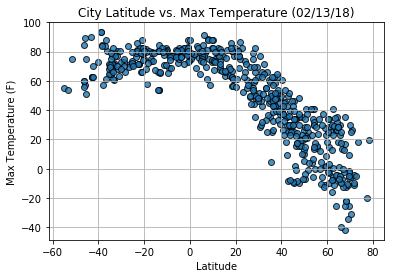
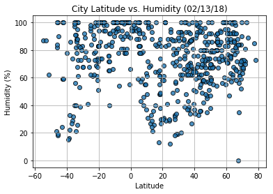
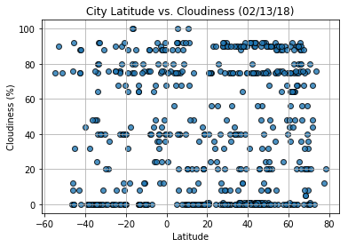
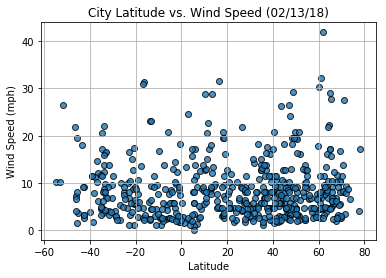

# WeatherPy
----

### Analysis
* As expected, the weather becomes significantly warmer as one approaches the equator (0 Deg. Latitude). More interestingly, however, is the fact that the southern hemisphere tends to be warmer this time of year than the northern hemisphere. This may be due to the tilt of the earth.
* There is no strong relationship between latitude and cloudiness, however, it is interesting to see that a strong band of cities sits at 0, 80, and 100% cloudiness.
* There is no strong relationship between latitude and wind speed, however in northern hemispheres there is a flurry of cities with over 20 mph of wind.


```python
# Updated the Weather Map API keys to unique keys and also ensure to store images with relevant names based on plot
# By: Aruna Amaresan
# Last Updated: Feb 13th 2018 

# Dependencies and Setup
import matplotlib.pyplot as plt
import pandas as pd
import numpy as np
import seaborn as sns
import requests
import time
import urllib

# Incorporated citipy to determine city based on latitude and longitude
from citipy import citipy

# Output File (CSV)
output_data_file = "output_data/cities.csv"

# Range of latitudes and longitudes
lat_range = (-90, 90)
lng_range = (-180, 180)
```

## Generate Cities List


```python
# List for holding lat_lngs and cities
lat_lngs = []
cities = []

# Create a set of random lat and lng combinations
lats = np.random.uniform(low=-90.000, high=90.000, size=1500)
lngs = np.random.uniform(low=-180.000, high=180.000, size=1500)
lat_lngs = zip(lats, lngs)

# Identify nearest city for each lat, lng combination
for lat_lng in lat_lngs:
    city = citipy.nearest_city(lat_lng[0], lat_lng[1]).city_name
    
    # If the city is unique, then add it to a our cities list
    if city not in cities:
        cities.append(city)

# Print the city count to confirm sufficient count
len(cities)
```


    616


## Perform API Calls


```python
# OpenWeatherMap API Key
#api_key_orig = "924783bda048569443e49dd6a03e5591"

api_key = "35f9addc033a3eddcd538e1df0680fd0"

# Starting URL for Weather Map API Call
url = "http://api.openweathermap.org/data/2.5/weather?units=Imperial&APPID=" + api_key 

# List of city data
city_data = []

# Print to logger
print("Beginning Data Retrieval     ")
print("-----------------------------")

# Create counters
record_count = 1
set_count = 1

# Loop through all the cities in our list
for i, city in enumerate(cities):
        
    # Group cities in sets of 50 for logging purposes
    if (i % 50 == 0 and i >= 50):
        set_count += 1
        record_count = 0

    # Create endpoint URL with each city
    city_url = url + "&q=" + urllib.request.pathname2url(city)

    # Log the url, record, and set numbers
    print("Processing Record %s of Set %s | %s" % (record_count, set_count, city))
    print(city_url)

    # Add 1 to the record count
    record_count += 1

    # Run an API request for each of the cities
    try:
        # Parse the JSON and retrieve data
        city_weather = requests.get(city_url).json()

        # Parse out the max temp, humidity, and cloudiness
        city_lat = city_weather["coord"]["lat"]
        city_lng = city_weather["coord"]["lon"]
        city_max_temp = city_weather["main"]["temp_max"]
        city_humidity = city_weather["main"]["humidity"]
        city_clouds = city_weather["clouds"]["all"]
        city_wind = city_weather["wind"]["speed"]
        city_country = city_weather["sys"]["country"]
        city_date = city_weather["dt"]

        # Append the City information into city_data list
        city_data.append({"City": city, 
                          "Lat": city_lat, 
                          "Lng": city_lng, 
                          "Max Temp": city_max_temp,
                          "Humidity": city_humidity,
                          "Cloudiness": city_clouds,
                          "Wind Speed": city_wind,
                          "Country": city_country,
                          "Date": city_date})

    # If an error is experienced, skip the city
    except:
        print("City not found. Skipping...")
        pass
              
# Indicate that Data Loading is complete 
print("-----------------------------")
print("Data Retrieval Complete      ")
print("-----------------------------")
        
        
```

    Beginning Data Retrieval     
    -----------------------------
    Processing Record 1 of Set 1 | chifeng
    http://api.openweathermap.org/data/2.5/weather?units=Imperial&APPID=35f9addc033a3eddcd538e1df0680fd0&q=chifeng
    Processing Record 2 of Set 1 | panjakent
    http://api.openweathermap.org/data/2.5/weather?units=Imperial&APPID=35f9addc033a3eddcd538e1df0680fd0&q=panjakent
    Processing Record 3 of Set 1 | paredon
    http://api.openweathermap.org/data/2.5/weather?units=Imperial&APPID=35f9addc033a3eddcd538e1df0680fd0&q=paredon
    Processing Record 4 of Set 1 | yellowknife
    http://api.openweathermap.org/data/2.5/weather?units=Imperial&APPID=35f9addc033a3eddcd538e1df0680fd0&q=yellowknife
    Processing Record 5 of Set 1 | vallenar
    http://api.openweathermap.org/data/2.5/weather?units=Imperial&APPID=35f9addc033a3eddcd538e1df0680fd0&q=vallenar
    Processing Record 6 of Set 1 | san jeronimo
    http://api.openweathermap.org/data/2.5/weather?units=Imperial&APPID=35f9addc033a3eddcd538e1df0680fd0&q=san%20jeronimo
    Processing Record 7 of Set 1 | vaini
    http://api.openweathermap.org/data/2.5/weather?units=Imperial&APPID=35f9addc033a3eddcd538e1df0680fd0&q=vaini
    Processing Record 8 of Set 1 | andenes
    http://api.openweathermap.org/data/2.5/weather?units=Imperial&APPID=35f9addc033a3eddcd538e1df0680fd0&q=andenes
    City not found. Skipping...
    Processing Record 9 of Set 1 | ushuaia
    http://api.openweathermap.org/data/2.5/weather?units=Imperial&APPID=35f9addc033a3eddcd538e1df0680fd0&q=ushuaia
    Processing Record 10 of Set 1 | hilo
    http://api.openweathermap.org/data/2.5/weather?units=Imperial&APPID=35f9addc033a3eddcd538e1df0680fd0&q=hilo
    Processing Record 11 of Set 1 | arraial do cabo
    http://api.openweathermap.org/data/2.5/weather?units=Imperial&APPID=35f9addc033a3eddcd538e1df0680fd0&q=arraial%20do%20cabo
    Processing Record 12 of Set 1 | kapaa
    http://api.openweathermap.org/data/2.5/weather?units=Imperial&APPID=35f9addc033a3eddcd538e1df0680fd0&q=kapaa
    Processing Record 13 of Set 1 | portland
    http://api.openweathermap.org/data/2.5/weather?units=Imperial&APPID=35f9addc033a3eddcd538e1df0680fd0&q=portland
    Processing Record 14 of Set 1 | rikitea
    http://api.openweathermap.org/data/2.5/weather?units=Imperial&APPID=35f9addc033a3eddcd538e1df0680fd0&q=rikitea
    Processing Record 15 of Set 1 | vaitupu
    http://api.openweathermap.org/data/2.5/weather?units=Imperial&APPID=35f9addc033a3eddcd538e1df0680fd0&q=vaitupu
    City not found. Skipping...
    Processing Record 16 of Set 1 | hay river
    http://api.openweathermap.org/data/2.5/weather?units=Imperial&APPID=35f9addc033a3eddcd538e1df0680fd0&q=hay%20river
    Processing Record 17 of Set 1 | ponta do sol
    http://api.openweathermap.org/data/2.5/weather?units=Imperial&APPID=35f9addc033a3eddcd538e1df0680fd0&q=ponta%20do%20sol
    Processing Record 18 of Set 1 | trincomalee
    http://api.openweathermap.org/data/2.5/weather?units=Imperial&APPID=35f9addc033a3eddcd538e1df0680fd0&q=trincomalee
    Processing Record 19 of Set 1 | cabo san lucas
    http://api.openweathermap.org/data/2.5/weather?units=Imperial&APPID=35f9addc033a3eddcd538e1df0680fd0&q=cabo%20san%20lucas
    Processing Record 20 of Set 1 | aswan
    http://api.openweathermap.org/data/2.5/weather?units=Imperial&APPID=35f9addc033a3eddcd538e1df0680fd0&q=aswan
    Processing Record 21 of Set 1 | mar del plata
    http://api.openweathermap.org/data/2.5/weather?units=Imperial&APPID=35f9addc033a3eddcd538e1df0680fd0&q=mar%20del%20plata
    Processing Record 22 of Set 1 | new norfolk
    http://api.openweathermap.org/data/2.5/weather?units=Imperial&APPID=35f9addc033a3eddcd538e1df0680fd0&q=new%20norfolk
    Processing Record 23 of Set 1 | saint-augustin
    http://api.openweathermap.org/data/2.5/weather?units=Imperial&APPID=35f9addc033a3eddcd538e1df0680fd0&q=saint-augustin
    Processing Record 24 of Set 1 | balikpapan
    http://api.openweathermap.org/data/2.5/weather?units=Imperial&APPID=35f9addc033a3eddcd538e1df0680fd0&q=balikpapan
    Processing Record 25 of Set 1 | flinders
    http://api.openweathermap.org/data/2.5/weather?units=Imperial&APPID=35f9addc033a3eddcd538e1df0680fd0&q=flinders
    Processing Record 26 of Set 1 | anloga
    http://api.openweathermap.org/data/2.5/weather?units=Imperial&APPID=35f9addc033a3eddcd538e1df0680fd0&q=anloga
    Processing Record 27 of Set 1 | bambous virieux
    http://api.openweathermap.org/data/2.5/weather?units=Imperial&APPID=35f9addc033a3eddcd538e1df0680fd0&q=bambous%20virieux
    Processing Record 28 of Set 1 | albany
    http://api.openweathermap.org/data/2.5/weather?units=Imperial&APPID=35f9addc033a3eddcd538e1df0680fd0&q=albany
    Processing Record 29 of Set 1 | papara
    http://api.openweathermap.org/data/2.5/weather?units=Imperial&APPID=35f9addc033a3eddcd538e1df0680fd0&q=papara
    Processing Record 30 of Set 1 | amderma
    http://api.openweathermap.org/data/2.5/weather?units=Imperial&APPID=35f9addc033a3eddcd538e1df0680fd0&q=amderma
    City not found. Skipping...
    Processing Record 31 of Set 1 | jamestown
    http://api.openweathermap.org/data/2.5/weather?units=Imperial&APPID=35f9addc033a3eddcd538e1df0680fd0&q=jamestown
    Processing Record 32 of Set 1 | loveland
    http://api.openweathermap.org/data/2.5/weather?units=Imperial&APPID=35f9addc033a3eddcd538e1df0680fd0&q=loveland
    Processing Record 33 of Set 1 | straumen
    http://api.openweathermap.org/data/2.5/weather?units=Imperial&APPID=35f9addc033a3eddcd538e1df0680fd0&q=straumen
    Processing Record 34 of Set 1 | port alfred
    http://api.openweathermap.org/data/2.5/weather?units=Imperial&APPID=35f9addc033a3eddcd538e1df0680fd0&q=port%20alfred
    Processing Record 35 of Set 1 | port hardy
    http://api.openweathermap.org/data/2.5/weather?units=Imperial&APPID=35f9addc033a3eddcd538e1df0680fd0&q=port%20hardy
    Processing Record 36 of Set 1 | shimoda
    http://api.openweathermap.org/data/2.5/weather?units=Imperial&APPID=35f9addc033a3eddcd538e1df0680fd0&q=shimoda
    Processing Record 37 of Set 1 | anqiu
    http://api.openweathermap.org/data/2.5/weather?units=Imperial&APPID=35f9addc033a3eddcd538e1df0680fd0&q=anqiu
    Processing Record 38 of Set 1 | dunedin
    http://api.openweathermap.org/data/2.5/weather?units=Imperial&APPID=35f9addc033a3eddcd538e1df0680fd0&q=dunedin
    Processing Record 39 of Set 1 | saquena
    http://api.openweathermap.org/data/2.5/weather?units=Imperial&APPID=35f9addc033a3eddcd538e1df0680fd0&q=saquena
    Processing Record 40 of Set 1 | barrow
    http://api.openweathermap.org/data/2.5/weather?units=Imperial&APPID=35f9addc033a3eddcd538e1df0680fd0&q=barrow
    Processing Record 41 of Set 1 | qaanaaq
    http://api.openweathermap.org/data/2.5/weather?units=Imperial&APPID=35f9addc033a3eddcd538e1df0680fd0&q=qaanaaq
    Processing Record 42 of Set 1 | talnakh
    http://api.openweathermap.org/data/2.5/weather?units=Imperial&APPID=35f9addc033a3eddcd538e1df0680fd0&q=talnakh
    Processing Record 43 of Set 1 | lavrentiya
    http://api.openweathermap.org/data/2.5/weather?units=Imperial&APPID=35f9addc033a3eddcd538e1df0680fd0&q=lavrentiya
    Processing Record 44 of Set 1 | kargasok
    http://api.openweathermap.org/data/2.5/weather?units=Imperial&APPID=35f9addc033a3eddcd538e1df0680fd0&q=kargasok
    Processing Record 45 of Set 1 | alice
    http://api.openweathermap.org/data/2.5/weather?units=Imperial&APPID=35f9addc033a3eddcd538e1df0680fd0&q=alice
    Processing Record 46 of Set 1 | gouyave
    http://api.openweathermap.org/data/2.5/weather?units=Imperial&APPID=35f9addc033a3eddcd538e1df0680fd0&q=gouyave
    Processing Record 47 of Set 1 | buraydah
    http://api.openweathermap.org/data/2.5/weather?units=Imperial&APPID=35f9addc033a3eddcd538e1df0680fd0&q=buraydah
    Processing Record 48 of Set 1 | cape town
    http://api.openweathermap.org/data/2.5/weather?units=Imperial&APPID=35f9addc033a3eddcd538e1df0680fd0&q=cape%20town
    Processing Record 49 of Set 1 | noumea
    http://api.openweathermap.org/data/2.5/weather?units=Imperial&APPID=35f9addc033a3eddcd538e1df0680fd0&q=noumea
    Processing Record 50 of Set 1 | clyde river
    http://api.openweathermap.org/data/2.5/weather?units=Imperial&APPID=35f9addc033a3eddcd538e1df0680fd0&q=clyde%20river
    Processing Record 0 of Set 2 | saint-philippe
    http://api.openweathermap.org/data/2.5/weather?units=Imperial&APPID=35f9addc033a3eddcd538e1df0680fd0&q=saint-philippe
    Processing Record 1 of Set 2 | deputatskiy
    http://api.openweathermap.org/data/2.5/weather?units=Imperial&APPID=35f9addc033a3eddcd538e1df0680fd0&q=deputatskiy
    Processing Record 2 of Set 2 | busselton
    http://api.openweathermap.org/data/2.5/weather?units=Imperial&APPID=35f9addc033a3eddcd538e1df0680fd0&q=busselton
    Processing Record 3 of Set 2 | bredasdorp
    http://api.openweathermap.org/data/2.5/weather?units=Imperial&APPID=35f9addc033a3eddcd538e1df0680fd0&q=bredasdorp
    Processing Record 4 of Set 2 | taolanaro
    http://api.openweathermap.org/data/2.5/weather?units=Imperial&APPID=35f9addc033a3eddcd538e1df0680fd0&q=taolanaro
    City not found. Skipping...
    Processing Record 5 of Set 2 | soyo
    http://api.openweathermap.org/data/2.5/weather?units=Imperial&APPID=35f9addc033a3eddcd538e1df0680fd0&q=soyo
    Processing Record 6 of Set 2 | tuktoyaktuk
    http://api.openweathermap.org/data/2.5/weather?units=Imperial&APPID=35f9addc033a3eddcd538e1df0680fd0&q=tuktoyaktuk
    Processing Record 7 of Set 2 | sawakin
    http://api.openweathermap.org/data/2.5/weather?units=Imperial&APPID=35f9addc033a3eddcd538e1df0680fd0&q=sawakin
    Processing Record 8 of Set 2 | riaba
    http://api.openweathermap.org/data/2.5/weather?units=Imperial&APPID=35f9addc033a3eddcd538e1df0680fd0&q=riaba
    City not found. Skipping...
    Processing Record 9 of Set 2 | thompson
    http://api.openweathermap.org/data/2.5/weather?units=Imperial&APPID=35f9addc033a3eddcd538e1df0680fd0&q=thompson
    Processing Record 10 of Set 2 | grand river south east
    http://api.openweathermap.org/data/2.5/weather?units=Imperial&APPID=35f9addc033a3eddcd538e1df0680fd0&q=grand%20river%20south%20east
    City not found. Skipping...
    Processing Record 11 of Set 2 | kodiak
    http://api.openweathermap.org/data/2.5/weather?units=Imperial&APPID=35f9addc033a3eddcd538e1df0680fd0&q=kodiak
    Processing Record 12 of Set 2 | sentyabrskiy
    http://api.openweathermap.org/data/2.5/weather?units=Imperial&APPID=35f9addc033a3eddcd538e1df0680fd0&q=sentyabrskiy
    City not found. Skipping...
    Processing Record 13 of Set 2 | bargarh
    http://api.openweathermap.org/data/2.5/weather?units=Imperial&APPID=35f9addc033a3eddcd538e1df0680fd0&q=bargarh
    Processing Record 14 of Set 2 | hasaki
    http://api.openweathermap.org/data/2.5/weather?units=Imperial&APPID=35f9addc033a3eddcd538e1df0680fd0&q=hasaki
    Processing Record 15 of Set 2 | punta arenas
    http://api.openweathermap.org/data/2.5/weather?units=Imperial&APPID=35f9addc033a3eddcd538e1df0680fd0&q=punta%20arenas
    Processing Record 16 of Set 2 | tsihombe
    http://api.openweathermap.org/data/2.5/weather?units=Imperial&APPID=35f9addc033a3eddcd538e1df0680fd0&q=tsihombe
    City not found. Skipping...
    Processing Record 17 of Set 2 | cayenne
    http://api.openweathermap.org/data/2.5/weather?units=Imperial&APPID=35f9addc033a3eddcd538e1df0680fd0&q=cayenne
    Processing Record 18 of Set 2 | nikolskoye
    http://api.openweathermap.org/data/2.5/weather?units=Imperial&APPID=35f9addc033a3eddcd538e1df0680fd0&q=nikolskoye
    Processing Record 19 of Set 2 | north vanlaiphai
    http://api.openweathermap.org/data/2.5/weather?units=Imperial&APPID=35f9addc033a3eddcd538e1df0680fd0&q=north%20vanlaiphai
    Processing Record 20 of Set 2 | tiksi
    http://api.openweathermap.org/data/2.5/weather?units=Imperial&APPID=35f9addc033a3eddcd538e1df0680fd0&q=tiksi
    Processing Record 21 of Set 2 | bowen
    http://api.openweathermap.org/data/2.5/weather?units=Imperial&APPID=35f9addc033a3eddcd538e1df0680fd0&q=bowen
    Processing Record 22 of Set 2 | miki
    http://api.openweathermap.org/data/2.5/weather?units=Imperial&APPID=35f9addc033a3eddcd538e1df0680fd0&q=miki
    Processing Record 23 of Set 2 | marshall
    http://api.openweathermap.org/data/2.5/weather?units=Imperial&APPID=35f9addc033a3eddcd538e1df0680fd0&q=marshall
    Processing Record 24 of Set 2 | san patricio
    http://api.openweathermap.org/data/2.5/weather?units=Imperial&APPID=35f9addc033a3eddcd538e1df0680fd0&q=san%20patricio
    Processing Record 25 of Set 2 | udachnyy
    http://api.openweathermap.org/data/2.5/weather?units=Imperial&APPID=35f9addc033a3eddcd538e1df0680fd0&q=udachnyy
    Processing Record 26 of Set 2 | juneau
    http://api.openweathermap.org/data/2.5/weather?units=Imperial&APPID=35f9addc033a3eddcd538e1df0680fd0&q=juneau
    Processing Record 27 of Set 2 | santa rosa
    http://api.openweathermap.org/data/2.5/weather?units=Imperial&APPID=35f9addc033a3eddcd538e1df0680fd0&q=santa%20rosa
    Processing Record 28 of Set 2 | turayf
    http://api.openweathermap.org/data/2.5/weather?units=Imperial&APPID=35f9addc033a3eddcd538e1df0680fd0&q=turayf
    Processing Record 29 of Set 2 | saint-pierre
    http://api.openweathermap.org/data/2.5/weather?units=Imperial&APPID=35f9addc033a3eddcd538e1df0680fd0&q=saint-pierre
    Processing Record 30 of Set 2 | hermanus
    http://api.openweathermap.org/data/2.5/weather?units=Imperial&APPID=35f9addc033a3eddcd538e1df0680fd0&q=hermanus
    Processing Record 31 of Set 2 | madarjac
    http://api.openweathermap.org/data/2.5/weather?units=Imperial&APPID=35f9addc033a3eddcd538e1df0680fd0&q=madarjac
    City not found. Skipping...
    Processing Record 32 of Set 2 | deh rawud
    http://api.openweathermap.org/data/2.5/weather?units=Imperial&APPID=35f9addc033a3eddcd538e1df0680fd0&q=deh%20rawud
    City not found. Skipping...
    Processing Record 33 of Set 2 | puerto ayora
    http://api.openweathermap.org/data/2.5/weather?units=Imperial&APPID=35f9addc033a3eddcd538e1df0680fd0&q=puerto%20ayora
    Processing Record 34 of Set 2 | mizan teferi
    http://api.openweathermap.org/data/2.5/weather?units=Imperial&APPID=35f9addc033a3eddcd538e1df0680fd0&q=mizan%20teferi
    Processing Record 35 of Set 2 | leningradskiy
    http://api.openweathermap.org/data/2.5/weather?units=Imperial&APPID=35f9addc033a3eddcd538e1df0680fd0&q=leningradskiy
    Processing Record 36 of Set 2 | strezhevoy
    http://api.openweathermap.org/data/2.5/weather?units=Imperial&APPID=35f9addc033a3eddcd538e1df0680fd0&q=strezhevoy
    Processing Record 37 of Set 2 | westport
    http://api.openweathermap.org/data/2.5/weather?units=Imperial&APPID=35f9addc033a3eddcd538e1df0680fd0&q=westport
    Processing Record 38 of Set 2 | turtas
    http://api.openweathermap.org/data/2.5/weather?units=Imperial&APPID=35f9addc033a3eddcd538e1df0680fd0&q=turtas
    Processing Record 39 of Set 2 | faanui
    http://api.openweathermap.org/data/2.5/weather?units=Imperial&APPID=35f9addc033a3eddcd538e1df0680fd0&q=faanui
    Processing Record 40 of Set 2 | ribeira grande
    http://api.openweathermap.org/data/2.5/weather?units=Imperial&APPID=35f9addc033a3eddcd538e1df0680fd0&q=ribeira%20grande
    Processing Record 41 of Set 2 | elblag
    http://api.openweathermap.org/data/2.5/weather?units=Imperial&APPID=35f9addc033a3eddcd538e1df0680fd0&q=elblag
    Processing Record 42 of Set 2 | bengkulu
    http://api.openweathermap.org/data/2.5/weather?units=Imperial&APPID=35f9addc033a3eddcd538e1df0680fd0&q=bengkulu
    City not found. Skipping...
    Processing Record 43 of Set 2 | bluff
    http://api.openweathermap.org/data/2.5/weather?units=Imperial&APPID=35f9addc033a3eddcd538e1df0680fd0&q=bluff
    Processing Record 44 of Set 2 | hamilton
    http://api.openweathermap.org/data/2.5/weather?units=Imperial&APPID=35f9addc033a3eddcd538e1df0680fd0&q=hamilton
    Processing Record 45 of Set 2 | huron
    http://api.openweathermap.org/data/2.5/weather?units=Imperial&APPID=35f9addc033a3eddcd538e1df0680fd0&q=huron
    Processing Record 46 of Set 2 | basco
    http://api.openweathermap.org/data/2.5/weather?units=Imperial&APPID=35f9addc033a3eddcd538e1df0680fd0&q=basco
    Processing Record 47 of Set 2 | canora
    http://api.openweathermap.org/data/2.5/weather?units=Imperial&APPID=35f9addc033a3eddcd538e1df0680fd0&q=canora
    Processing Record 48 of Set 2 | pevek
    http://api.openweathermap.org/data/2.5/weather?units=Imperial&APPID=35f9addc033a3eddcd538e1df0680fd0&q=pevek
    Processing Record 49 of Set 2 | hobart
    http://api.openweathermap.org/data/2.5/weather?units=Imperial&APPID=35f9addc033a3eddcd538e1df0680fd0&q=hobart
    Processing Record 0 of Set 3 | aripuana
    http://api.openweathermap.org/data/2.5/weather?units=Imperial&APPID=35f9addc033a3eddcd538e1df0680fd0&q=aripuana
    Processing Record 1 of Set 3 | chokurdakh
    http://api.openweathermap.org/data/2.5/weather?units=Imperial&APPID=35f9addc033a3eddcd538e1df0680fd0&q=chokurdakh
    Processing Record 2 of Set 3 | whitehorse
    http://api.openweathermap.org/data/2.5/weather?units=Imperial&APPID=35f9addc033a3eddcd538e1df0680fd0&q=whitehorse
    Processing Record 3 of Set 3 | jalu
    http://api.openweathermap.org/data/2.5/weather?units=Imperial&APPID=35f9addc033a3eddcd538e1df0680fd0&q=jalu
    Processing Record 4 of Set 3 | kamenskoye
    http://api.openweathermap.org/data/2.5/weather?units=Imperial&APPID=35f9addc033a3eddcd538e1df0680fd0&q=kamenskoye
    City not found. Skipping...
    Processing Record 5 of Set 3 | east bethel
    http://api.openweathermap.org/data/2.5/weather?units=Imperial&APPID=35f9addc033a3eddcd538e1df0680fd0&q=east%20bethel
    Processing Record 6 of Set 3 | ahipara
    http://api.openweathermap.org/data/2.5/weather?units=Imperial&APPID=35f9addc033a3eddcd538e1df0680fd0&q=ahipara
    Processing Record 7 of Set 3 | barentsburg
    http://api.openweathermap.org/data/2.5/weather?units=Imperial&APPID=35f9addc033a3eddcd538e1df0680fd0&q=barentsburg
    City not found. Skipping...
    Processing Record 8 of Set 3 | albina
    http://api.openweathermap.org/data/2.5/weather?units=Imperial&APPID=35f9addc033a3eddcd538e1df0680fd0&q=albina
    Processing Record 9 of Set 3 | airai
    http://api.openweathermap.org/data/2.5/weather?units=Imperial&APPID=35f9addc033a3eddcd538e1df0680fd0&q=airai
    Processing Record 10 of Set 3 | mahebourg
    http://api.openweathermap.org/data/2.5/weather?units=Imperial&APPID=35f9addc033a3eddcd538e1df0680fd0&q=mahebourg
    Processing Record 11 of Set 3 | hokitika
    http://api.openweathermap.org/data/2.5/weather?units=Imperial&APPID=35f9addc033a3eddcd538e1df0680fd0&q=hokitika
    Processing Record 12 of Set 3 | alta gracia
    http://api.openweathermap.org/data/2.5/weather?units=Imperial&APPID=35f9addc033a3eddcd538e1df0680fd0&q=alta%20gracia
    Processing Record 13 of Set 3 | bilibino
    http://api.openweathermap.org/data/2.5/weather?units=Imperial&APPID=35f9addc033a3eddcd538e1df0680fd0&q=bilibino
    Processing Record 14 of Set 3 | hithadhoo
    http://api.openweathermap.org/data/2.5/weather?units=Imperial&APPID=35f9addc033a3eddcd538e1df0680fd0&q=hithadhoo
    Processing Record 15 of Set 3 | austin
    http://api.openweathermap.org/data/2.5/weather?units=Imperial&APPID=35f9addc033a3eddcd538e1df0680fd0&q=austin
    Processing Record 16 of Set 3 | virginia beach
    http://api.openweathermap.org/data/2.5/weather?units=Imperial&APPID=35f9addc033a3eddcd538e1df0680fd0&q=virginia%20beach
    Processing Record 17 of Set 3 | sebastian
    http://api.openweathermap.org/data/2.5/weather?units=Imperial&APPID=35f9addc033a3eddcd538e1df0680fd0&q=sebastian
    Processing Record 18 of Set 3 | lyaskelya
    http://api.openweathermap.org/data/2.5/weather?units=Imperial&APPID=35f9addc033a3eddcd538e1df0680fd0&q=lyaskelya
    Processing Record 19 of Set 3 | maraa
    http://api.openweathermap.org/data/2.5/weather?units=Imperial&APPID=35f9addc033a3eddcd538e1df0680fd0&q=maraa
    Processing Record 20 of Set 3 | butaritari
    http://api.openweathermap.org/data/2.5/weather?units=Imperial&APPID=35f9addc033a3eddcd538e1df0680fd0&q=butaritari
    Processing Record 21 of Set 3 | karamea
    http://api.openweathermap.org/data/2.5/weather?units=Imperial&APPID=35f9addc033a3eddcd538e1df0680fd0&q=karamea
    City not found. Skipping...
    Processing Record 22 of Set 3 | tasiilaq
    http://api.openweathermap.org/data/2.5/weather?units=Imperial&APPID=35f9addc033a3eddcd538e1df0680fd0&q=tasiilaq
    Processing Record 23 of Set 3 | blythe
    http://api.openweathermap.org/data/2.5/weather?units=Imperial&APPID=35f9addc033a3eddcd538e1df0680fd0&q=blythe
    Processing Record 24 of Set 3 | haines junction
    http://api.openweathermap.org/data/2.5/weather?units=Imperial&APPID=35f9addc033a3eddcd538e1df0680fd0&q=haines%20junction
    Processing Record 25 of Set 3 | samusu
    http://api.openweathermap.org/data/2.5/weather?units=Imperial&APPID=35f9addc033a3eddcd538e1df0680fd0&q=samusu
    City not found. Skipping...
    Processing Record 26 of Set 3 | geraldton
    http://api.openweathermap.org/data/2.5/weather?units=Imperial&APPID=35f9addc033a3eddcd538e1df0680fd0&q=geraldton
    Processing Record 27 of Set 3 | dikson
    http://api.openweathermap.org/data/2.5/weather?units=Imperial&APPID=35f9addc033a3eddcd538e1df0680fd0&q=dikson
    Processing Record 28 of Set 3 | noyabrsk
    http://api.openweathermap.org/data/2.5/weather?units=Imperial&APPID=35f9addc033a3eddcd538e1df0680fd0&q=noyabrsk
    Processing Record 29 of Set 3 | khatanga
    http://api.openweathermap.org/data/2.5/weather?units=Imperial&APPID=35f9addc033a3eddcd538e1df0680fd0&q=khatanga
    Processing Record 30 of Set 3 | te anau
    http://api.openweathermap.org/data/2.5/weather?units=Imperial&APPID=35f9addc033a3eddcd538e1df0680fd0&q=te%20anau
    Processing Record 31 of Set 3 | tuy hoa
    http://api.openweathermap.org/data/2.5/weather?units=Imperial&APPID=35f9addc033a3eddcd538e1df0680fd0&q=tuy%20hoa
    Processing Record 32 of Set 3 | san quintin
    http://api.openweathermap.org/data/2.5/weather?units=Imperial&APPID=35f9addc033a3eddcd538e1df0680fd0&q=san%20quintin
    Processing Record 33 of Set 3 | mocuba
    http://api.openweathermap.org/data/2.5/weather?units=Imperial&APPID=35f9addc033a3eddcd538e1df0680fd0&q=mocuba
    Processing Record 34 of Set 3 | ilulissat
    http://api.openweathermap.org/data/2.5/weather?units=Imperial&APPID=35f9addc033a3eddcd538e1df0680fd0&q=ilulissat
    Processing Record 35 of Set 3 | odweyne
    http://api.openweathermap.org/data/2.5/weather?units=Imperial&APPID=35f9addc033a3eddcd538e1df0680fd0&q=odweyne
    City not found. Skipping...
    Processing Record 36 of Set 3 | sakakah
    http://api.openweathermap.org/data/2.5/weather?units=Imperial&APPID=35f9addc033a3eddcd538e1df0680fd0&q=sakakah
    City not found. Skipping...
    Processing Record 37 of Set 3 | kirakira
    http://api.openweathermap.org/data/2.5/weather?units=Imperial&APPID=35f9addc033a3eddcd538e1df0680fd0&q=kirakira
    Processing Record 38 of Set 3 | tula
    http://api.openweathermap.org/data/2.5/weather?units=Imperial&APPID=35f9addc033a3eddcd538e1df0680fd0&q=tula
    Processing Record 39 of Set 3 | grindavik
    http://api.openweathermap.org/data/2.5/weather?units=Imperial&APPID=35f9addc033a3eddcd538e1df0680fd0&q=grindavik
    Processing Record 40 of Set 3 | lompoc
    http://api.openweathermap.org/data/2.5/weather?units=Imperial&APPID=35f9addc033a3eddcd538e1df0680fd0&q=lompoc
    Processing Record 41 of Set 3 | karratha
    http://api.openweathermap.org/data/2.5/weather?units=Imperial&APPID=35f9addc033a3eddcd538e1df0680fd0&q=karratha
    Processing Record 42 of Set 3 | vila velha
    http://api.openweathermap.org/data/2.5/weather?units=Imperial&APPID=35f9addc033a3eddcd538e1df0680fd0&q=vila%20velha
    Processing Record 43 of Set 3 | alofi
    http://api.openweathermap.org/data/2.5/weather?units=Imperial&APPID=35f9addc033a3eddcd538e1df0680fd0&q=alofi
    Processing Record 44 of Set 3 | dolores
    http://api.openweathermap.org/data/2.5/weather?units=Imperial&APPID=35f9addc033a3eddcd538e1df0680fd0&q=dolores
    Processing Record 45 of Set 3 | alice springs
    http://api.openweathermap.org/data/2.5/weather?units=Imperial&APPID=35f9addc033a3eddcd538e1df0680fd0&q=alice%20springs
    Processing Record 46 of Set 3 | georgetown
    http://api.openweathermap.org/data/2.5/weather?units=Imperial&APPID=35f9addc033a3eddcd538e1df0680fd0&q=georgetown
    Processing Record 47 of Set 3 | nanortalik
    http://api.openweathermap.org/data/2.5/weather?units=Imperial&APPID=35f9addc033a3eddcd538e1df0680fd0&q=nanortalik
    Processing Record 48 of Set 3 | saldanha
    http://api.openweathermap.org/data/2.5/weather?units=Imperial&APPID=35f9addc033a3eddcd538e1df0680fd0&q=saldanha
    Processing Record 49 of Set 3 | miles city
    http://api.openweathermap.org/data/2.5/weather?units=Imperial&APPID=35f9addc033a3eddcd538e1df0680fd0&q=miles%20city
    Processing Record 0 of Set 4 | lebu
    http://api.openweathermap.org/data/2.5/weather?units=Imperial&APPID=35f9addc033a3eddcd538e1df0680fd0&q=lebu
    Processing Record 1 of Set 4 | yarkovo
    http://api.openweathermap.org/data/2.5/weather?units=Imperial&APPID=35f9addc033a3eddcd538e1df0680fd0&q=yarkovo
    Processing Record 2 of Set 4 | mount isa
    http://api.openweathermap.org/data/2.5/weather?units=Imperial&APPID=35f9addc033a3eddcd538e1df0680fd0&q=mount%20isa
    Processing Record 3 of Set 4 | atuona
    http://api.openweathermap.org/data/2.5/weather?units=Imperial&APPID=35f9addc033a3eddcd538e1df0680fd0&q=atuona
    Processing Record 4 of Set 4 | mareeba
    http://api.openweathermap.org/data/2.5/weather?units=Imperial&APPID=35f9addc033a3eddcd538e1df0680fd0&q=mareeba
    Processing Record 5 of Set 4 | baghdad
    http://api.openweathermap.org/data/2.5/weather?units=Imperial&APPID=35f9addc033a3eddcd538e1df0680fd0&q=baghdad
    Processing Record 6 of Set 4 | provideniya
    http://api.openweathermap.org/data/2.5/weather?units=Imperial&APPID=35f9addc033a3eddcd538e1df0680fd0&q=provideniya
    Processing Record 7 of Set 4 | dukat
    http://api.openweathermap.org/data/2.5/weather?units=Imperial&APPID=35f9addc033a3eddcd538e1df0680fd0&q=dukat
    Processing Record 8 of Set 4 | cidreira
    http://api.openweathermap.org/data/2.5/weather?units=Imperial&APPID=35f9addc033a3eddcd538e1df0680fd0&q=cidreira
    Processing Record 9 of Set 4 | comodoro rivadavia
    http://api.openweathermap.org/data/2.5/weather?units=Imperial&APPID=35f9addc033a3eddcd538e1df0680fd0&q=comodoro%20rivadavia
    Processing Record 10 of Set 4 | meinung
    http://api.openweathermap.org/data/2.5/weather?units=Imperial&APPID=35f9addc033a3eddcd538e1df0680fd0&q=meinung
    City not found. Skipping...
    Processing Record 11 of Set 4 | taburi
    http://api.openweathermap.org/data/2.5/weather?units=Imperial&APPID=35f9addc033a3eddcd538e1df0680fd0&q=taburi
    City not found. Skipping...
    Processing Record 12 of Set 4 | mashhad
    http://api.openweathermap.org/data/2.5/weather?units=Imperial&APPID=35f9addc033a3eddcd538e1df0680fd0&q=mashhad
    Processing Record 13 of Set 4 | keelung
    http://api.openweathermap.org/data/2.5/weather?units=Imperial&APPID=35f9addc033a3eddcd538e1df0680fd0&q=keelung
    Processing Record 14 of Set 4 | longyearbyen
    http://api.openweathermap.org/data/2.5/weather?units=Imperial&APPID=35f9addc033a3eddcd538e1df0680fd0&q=longyearbyen
    Processing Record 15 of Set 4 | bathsheba
    http://api.openweathermap.org/data/2.5/weather?units=Imperial&APPID=35f9addc033a3eddcd538e1df0680fd0&q=bathsheba
    Processing Record 16 of Set 4 | muros
    http://api.openweathermap.org/data/2.5/weather?units=Imperial&APPID=35f9addc033a3eddcd538e1df0680fd0&q=muros
    Processing Record 17 of Set 4 | kurunegala
    http://api.openweathermap.org/data/2.5/weather?units=Imperial&APPID=35f9addc033a3eddcd538e1df0680fd0&q=kurunegala
    Processing Record 18 of Set 4 | tabiauea
    http://api.openweathermap.org/data/2.5/weather?units=Imperial&APPID=35f9addc033a3eddcd538e1df0680fd0&q=tabiauea
    City not found. Skipping...
    Processing Record 19 of Set 4 | lensk
    http://api.openweathermap.org/data/2.5/weather?units=Imperial&APPID=35f9addc033a3eddcd538e1df0680fd0&q=lensk
    Processing Record 20 of Set 4 | kazerun
    http://api.openweathermap.org/data/2.5/weather?units=Imperial&APPID=35f9addc033a3eddcd538e1df0680fd0&q=kazerun
    Processing Record 21 of Set 4 | codrington
    http://api.openweathermap.org/data/2.5/weather?units=Imperial&APPID=35f9addc033a3eddcd538e1df0680fd0&q=codrington
    Processing Record 22 of Set 4 | castro
    http://api.openweathermap.org/data/2.5/weather?units=Imperial&APPID=35f9addc033a3eddcd538e1df0680fd0&q=castro
    Processing Record 23 of Set 4 | kholodnyy
    http://api.openweathermap.org/data/2.5/weather?units=Imperial&APPID=35f9addc033a3eddcd538e1df0680fd0&q=kholodnyy
    Processing Record 24 of Set 4 | mataura
    http://api.openweathermap.org/data/2.5/weather?units=Imperial&APPID=35f9addc033a3eddcd538e1df0680fd0&q=mataura
    Processing Record 25 of Set 4 | bako
    http://api.openweathermap.org/data/2.5/weather?units=Imperial&APPID=35f9addc033a3eddcd538e1df0680fd0&q=bako
    Processing Record 26 of Set 4 | navahrudak
    http://api.openweathermap.org/data/2.5/weather?units=Imperial&APPID=35f9addc033a3eddcd538e1df0680fd0&q=navahrudak
    Processing Record 27 of Set 4 | yulara
    http://api.openweathermap.org/data/2.5/weather?units=Imperial&APPID=35f9addc033a3eddcd538e1df0680fd0&q=yulara
    Processing Record 28 of Set 4 | havelock
    http://api.openweathermap.org/data/2.5/weather?units=Imperial&APPID=35f9addc033a3eddcd538e1df0680fd0&q=havelock
    Processing Record 29 of Set 4 | ojinaga
    http://api.openweathermap.org/data/2.5/weather?units=Imperial&APPID=35f9addc033a3eddcd538e1df0680fd0&q=ojinaga
    Processing Record 30 of Set 4 | la venta del astillero
    http://api.openweathermap.org/data/2.5/weather?units=Imperial&APPID=35f9addc033a3eddcd538e1df0680fd0&q=la%20venta%20del%20astillero
    Processing Record 31 of Set 4 | cherskiy
    http://api.openweathermap.org/data/2.5/weather?units=Imperial&APPID=35f9addc033a3eddcd538e1df0680fd0&q=cherskiy
    Processing Record 32 of Set 4 | north bend
    http://api.openweathermap.org/data/2.5/weather?units=Imperial&APPID=35f9addc033a3eddcd538e1df0680fd0&q=north%20bend
    Processing Record 33 of Set 4 | pacific grove
    http://api.openweathermap.org/data/2.5/weather?units=Imperial&APPID=35f9addc033a3eddcd538e1df0680fd0&q=pacific%20grove
    Processing Record 34 of Set 4 | nuuk
    http://api.openweathermap.org/data/2.5/weather?units=Imperial&APPID=35f9addc033a3eddcd538e1df0680fd0&q=nuuk
    Processing Record 35 of Set 4 | saskylakh
    http://api.openweathermap.org/data/2.5/weather?units=Imperial&APPID=35f9addc033a3eddcd538e1df0680fd0&q=saskylakh
    Processing Record 36 of Set 4 | lasa
    http://api.openweathermap.org/data/2.5/weather?units=Imperial&APPID=35f9addc033a3eddcd538e1df0680fd0&q=lasa
    Processing Record 37 of Set 4 | kaitangata
    http://api.openweathermap.org/data/2.5/weather?units=Imperial&APPID=35f9addc033a3eddcd538e1df0680fd0&q=kaitangata
    Processing Record 38 of Set 4 | iqaluit
    http://api.openweathermap.org/data/2.5/weather?units=Imperial&APPID=35f9addc033a3eddcd538e1df0680fd0&q=iqaluit
    Processing Record 39 of Set 4 | mys shmidta
    http://api.openweathermap.org/data/2.5/weather?units=Imperial&APPID=35f9addc033a3eddcd538e1df0680fd0&q=mys%20shmidta
    City not found. Skipping...
    Processing Record 40 of Set 4 | makakilo city
    http://api.openweathermap.org/data/2.5/weather?units=Imperial&APPID=35f9addc033a3eddcd538e1df0680fd0&q=makakilo%20city
    Processing Record 41 of Set 4 | lagoa
    http://api.openweathermap.org/data/2.5/weather?units=Imperial&APPID=35f9addc033a3eddcd538e1df0680fd0&q=lagoa
    Processing Record 42 of Set 4 | lazaro cardenas
    http://api.openweathermap.org/data/2.5/weather?units=Imperial&APPID=35f9addc033a3eddcd538e1df0680fd0&q=lazaro%20cardenas
    Processing Record 43 of Set 4 | kimbe
    http://api.openweathermap.org/data/2.5/weather?units=Imperial&APPID=35f9addc033a3eddcd538e1df0680fd0&q=kimbe
    Processing Record 44 of Set 4 | touros
    http://api.openweathermap.org/data/2.5/weather?units=Imperial&APPID=35f9addc033a3eddcd538e1df0680fd0&q=touros
    Processing Record 45 of Set 4 | quatre cocos
    http://api.openweathermap.org/data/2.5/weather?units=Imperial&APPID=35f9addc033a3eddcd538e1df0680fd0&q=quatre%20cocos
    Processing Record 46 of Set 4 | manono
    http://api.openweathermap.org/data/2.5/weather?units=Imperial&APPID=35f9addc033a3eddcd538e1df0680fd0&q=manono
    Processing Record 47 of Set 4 | schweinfurt
    http://api.openweathermap.org/data/2.5/weather?units=Imperial&APPID=35f9addc033a3eddcd538e1df0680fd0&q=schweinfurt
    Processing Record 48 of Set 4 | atasu
    http://api.openweathermap.org/data/2.5/weather?units=Imperial&APPID=35f9addc033a3eddcd538e1df0680fd0&q=atasu
    Processing Record 49 of Set 4 | rio gallegos
    http://api.openweathermap.org/data/2.5/weather?units=Imperial&APPID=35f9addc033a3eddcd538e1df0680fd0&q=rio%20gallegos
    Processing Record 0 of Set 5 | sao joao da barra
    http://api.openweathermap.org/data/2.5/weather?units=Imperial&APPID=35f9addc033a3eddcd538e1df0680fd0&q=sao%20joao%20da%20barra
    Processing Record 1 of Set 5 | kavieng
    http://api.openweathermap.org/data/2.5/weather?units=Imperial&APPID=35f9addc033a3eddcd538e1df0680fd0&q=kavieng
    Processing Record 2 of Set 5 | oktyabrskiy
    http://api.openweathermap.org/data/2.5/weather?units=Imperial&APPID=35f9addc033a3eddcd538e1df0680fd0&q=oktyabrskiy
    Processing Record 3 of Set 5 | klaksvik
    http://api.openweathermap.org/data/2.5/weather?units=Imperial&APPID=35f9addc033a3eddcd538e1df0680fd0&q=klaksvik
    Processing Record 4 of Set 5 | tamandare
    http://api.openweathermap.org/data/2.5/weather?units=Imperial&APPID=35f9addc033a3eddcd538e1df0680fd0&q=tamandare
    Processing Record 5 of Set 5 | sao felix do xingu
    http://api.openweathermap.org/data/2.5/weather?units=Imperial&APPID=35f9addc033a3eddcd538e1df0680fd0&q=sao%20felix%20do%20xingu
    Processing Record 6 of Set 5 | ambon
    http://api.openweathermap.org/data/2.5/weather?units=Imperial&APPID=35f9addc033a3eddcd538e1df0680fd0&q=ambon
    Processing Record 7 of Set 5 | upernavik
    http://api.openweathermap.org/data/2.5/weather?units=Imperial&APPID=35f9addc033a3eddcd538e1df0680fd0&q=upernavik
    Processing Record 8 of Set 5 | mackay
    http://api.openweathermap.org/data/2.5/weather?units=Imperial&APPID=35f9addc033a3eddcd538e1df0680fd0&q=mackay
    Processing Record 9 of Set 5 | simpang
    http://api.openweathermap.org/data/2.5/weather?units=Imperial&APPID=35f9addc033a3eddcd538e1df0680fd0&q=simpang
    Processing Record 10 of Set 5 | devils lake
    http://api.openweathermap.org/data/2.5/weather?units=Imperial&APPID=35f9addc033a3eddcd538e1df0680fd0&q=devils%20lake
    Processing Record 11 of Set 5 | zhigansk
    http://api.openweathermap.org/data/2.5/weather?units=Imperial&APPID=35f9addc033a3eddcd538e1df0680fd0&q=zhigansk
    Processing Record 12 of Set 5 | chapais
    http://api.openweathermap.org/data/2.5/weather?units=Imperial&APPID=35f9addc033a3eddcd538e1df0680fd0&q=chapais
    Processing Record 13 of Set 5 | havoysund
    http://api.openweathermap.org/data/2.5/weather?units=Imperial&APPID=35f9addc033a3eddcd538e1df0680fd0&q=havoysund
    Processing Record 14 of Set 5 | laguna
    http://api.openweathermap.org/data/2.5/weather?units=Imperial&APPID=35f9addc033a3eddcd538e1df0680fd0&q=laguna
    Processing Record 15 of Set 5 | saint-francois
    http://api.openweathermap.org/data/2.5/weather?units=Imperial&APPID=35f9addc033a3eddcd538e1df0680fd0&q=saint-francois
    Processing Record 16 of Set 5 | illoqqortoormiut
    http://api.openweathermap.org/data/2.5/weather?units=Imperial&APPID=35f9addc033a3eddcd538e1df0680fd0&q=illoqqortoormiut
    City not found. Skipping...
    Processing Record 17 of Set 5 | acheng
    http://api.openweathermap.org/data/2.5/weather?units=Imperial&APPID=35f9addc033a3eddcd538e1df0680fd0&q=acheng
    Processing Record 18 of Set 5 | salalah
    http://api.openweathermap.org/data/2.5/weather?units=Imperial&APPID=35f9addc033a3eddcd538e1df0680fd0&q=salalah
    Processing Record 19 of Set 5 | port elizabeth
    http://api.openweathermap.org/data/2.5/weather?units=Imperial&APPID=35f9addc033a3eddcd538e1df0680fd0&q=port%20elizabeth
    Processing Record 20 of Set 5 | digha
    http://api.openweathermap.org/data/2.5/weather?units=Imperial&APPID=35f9addc033a3eddcd538e1df0680fd0&q=digha
    Processing Record 21 of Set 5 | rio grande
    http://api.openweathermap.org/data/2.5/weather?units=Imperial&APPID=35f9addc033a3eddcd538e1df0680fd0&q=rio%20grande
    Processing Record 22 of Set 5 | tondano
    http://api.openweathermap.org/data/2.5/weather?units=Imperial&APPID=35f9addc033a3eddcd538e1df0680fd0&q=tondano
    Processing Record 23 of Set 5 | port lincoln
    http://api.openweathermap.org/data/2.5/weather?units=Imperial&APPID=35f9addc033a3eddcd538e1df0680fd0&q=port%20lincoln
    Processing Record 24 of Set 5 | the valley
    http://api.openweathermap.org/data/2.5/weather?units=Imperial&APPID=35f9addc033a3eddcd538e1df0680fd0&q=the%20valley
    Processing Record 25 of Set 5 | beringovskiy
    http://api.openweathermap.org/data/2.5/weather?units=Imperial&APPID=35f9addc033a3eddcd538e1df0680fd0&q=beringovskiy
    Processing Record 26 of Set 5 | east london
    http://api.openweathermap.org/data/2.5/weather?units=Imperial&APPID=35f9addc033a3eddcd538e1df0680fd0&q=east%20london
    Processing Record 27 of Set 5 | dudinka
    http://api.openweathermap.org/data/2.5/weather?units=Imperial&APPID=35f9addc033a3eddcd538e1df0680fd0&q=dudinka
    Processing Record 28 of Set 5 | san mateo del mar
    http://api.openweathermap.org/data/2.5/weather?units=Imperial&APPID=35f9addc033a3eddcd538e1df0680fd0&q=san%20mateo%20del%20mar
    Processing Record 29 of Set 5 | kualakapuas
    http://api.openweathermap.org/data/2.5/weather?units=Imperial&APPID=35f9addc033a3eddcd538e1df0680fd0&q=kualakapuas
    Processing Record 30 of Set 5 | kisangani
    http://api.openweathermap.org/data/2.5/weather?units=Imperial&APPID=35f9addc033a3eddcd538e1df0680fd0&q=kisangani
    Processing Record 31 of Set 5 | nchelenge
    http://api.openweathermap.org/data/2.5/weather?units=Imperial&APPID=35f9addc033a3eddcd538e1df0680fd0&q=nchelenge
    Processing Record 32 of Set 5 | sarangani
    http://api.openweathermap.org/data/2.5/weather?units=Imperial&APPID=35f9addc033a3eddcd538e1df0680fd0&q=sarangani
    Processing Record 33 of Set 5 | mawlaik
    http://api.openweathermap.org/data/2.5/weather?units=Imperial&APPID=35f9addc033a3eddcd538e1df0680fd0&q=mawlaik
    Processing Record 34 of Set 5 | segou
    http://api.openweathermap.org/data/2.5/weather?units=Imperial&APPID=35f9addc033a3eddcd538e1df0680fd0&q=segou
    Processing Record 35 of Set 5 | gallup
    http://api.openweathermap.org/data/2.5/weather?units=Imperial&APPID=35f9addc033a3eddcd538e1df0680fd0&q=gallup
    Processing Record 36 of Set 5 | biltine
    http://api.openweathermap.org/data/2.5/weather?units=Imperial&APPID=35f9addc033a3eddcd538e1df0680fd0&q=biltine
    Processing Record 37 of Set 5 | karak
    http://api.openweathermap.org/data/2.5/weather?units=Imperial&APPID=35f9addc033a3eddcd538e1df0680fd0&q=karak
    Processing Record 38 of Set 5 | moro
    http://api.openweathermap.org/data/2.5/weather?units=Imperial&APPID=35f9addc033a3eddcd538e1df0680fd0&q=moro
    Processing Record 39 of Set 5 | dzhusaly
    http://api.openweathermap.org/data/2.5/weather?units=Imperial&APPID=35f9addc033a3eddcd538e1df0680fd0&q=dzhusaly
    City not found. Skipping...
    Processing Record 40 of Set 5 | coihaique
    http://api.openweathermap.org/data/2.5/weather?units=Imperial&APPID=35f9addc033a3eddcd538e1df0680fd0&q=coihaique
    Processing Record 41 of Set 5 | snasa
    http://api.openweathermap.org/data/2.5/weather?units=Imperial&APPID=35f9addc033a3eddcd538e1df0680fd0&q=snasa
    Processing Record 42 of Set 5 | asfi
    http://api.openweathermap.org/data/2.5/weather?units=Imperial&APPID=35f9addc033a3eddcd538e1df0680fd0&q=asfi
    City not found. Skipping...
    Processing Record 43 of Set 5 | meadow lake
    http://api.openweathermap.org/data/2.5/weather?units=Imperial&APPID=35f9addc033a3eddcd538e1df0680fd0&q=meadow%20lake
    Processing Record 44 of Set 5 | tezu
    http://api.openweathermap.org/data/2.5/weather?units=Imperial&APPID=35f9addc033a3eddcd538e1df0680fd0&q=tezu
    Processing Record 45 of Set 5 | rosamorada
    http://api.openweathermap.org/data/2.5/weather?units=Imperial&APPID=35f9addc033a3eddcd538e1df0680fd0&q=rosamorada
    Processing Record 46 of Set 5 | fuerte olimpo
    http://api.openweathermap.org/data/2.5/weather?units=Imperial&APPID=35f9addc033a3eddcd538e1df0680fd0&q=fuerte%20olimpo
    Processing Record 47 of Set 5 | neuquen
    http://api.openweathermap.org/data/2.5/weather?units=Imperial&APPID=35f9addc033a3eddcd538e1df0680fd0&q=neuquen
    Processing Record 48 of Set 5 | caravelas
    http://api.openweathermap.org/data/2.5/weather?units=Imperial&APPID=35f9addc033a3eddcd538e1df0680fd0&q=caravelas
    Processing Record 49 of Set 5 | chuy
    http://api.openweathermap.org/data/2.5/weather?units=Imperial&APPID=35f9addc033a3eddcd538e1df0680fd0&q=chuy
    Processing Record 0 of Set 6 | trairi
    http://api.openweathermap.org/data/2.5/weather?units=Imperial&APPID=35f9addc033a3eddcd538e1df0680fd0&q=trairi
    Processing Record 1 of Set 6 | cagayan de tawi-tawi
    http://api.openweathermap.org/data/2.5/weather?units=Imperial&APPID=35f9addc033a3eddcd538e1df0680fd0&q=cagayan%20de%20tawi-tawi
    City not found. Skipping...
    Processing Record 2 of Set 6 | norman wells
    http://api.openweathermap.org/data/2.5/weather?units=Imperial&APPID=35f9addc033a3eddcd538e1df0680fd0&q=norman%20wells
    Processing Record 3 of Set 6 | kiama
    http://api.openweathermap.org/data/2.5/weather?units=Imperial&APPID=35f9addc033a3eddcd538e1df0680fd0&q=kiama
    Processing Record 4 of Set 6 | burica
    http://api.openweathermap.org/data/2.5/weather?units=Imperial&APPID=35f9addc033a3eddcd538e1df0680fd0&q=burica
    City not found. Skipping...
    Processing Record 5 of Set 6 | asayita
    http://api.openweathermap.org/data/2.5/weather?units=Imperial&APPID=35f9addc033a3eddcd538e1df0680fd0&q=asayita
    City not found. Skipping...
    Processing Record 6 of Set 6 | ayan
    http://api.openweathermap.org/data/2.5/weather?units=Imperial&APPID=35f9addc033a3eddcd538e1df0680fd0&q=ayan
    Processing Record 7 of Set 6 | nome
    http://api.openweathermap.org/data/2.5/weather?units=Imperial&APPID=35f9addc033a3eddcd538e1df0680fd0&q=nome
    Processing Record 8 of Set 6 | berezovka
    http://api.openweathermap.org/data/2.5/weather?units=Imperial&APPID=35f9addc033a3eddcd538e1df0680fd0&q=berezovka
    Processing Record 9 of Set 6 | yeppoon
    http://api.openweathermap.org/data/2.5/weather?units=Imperial&APPID=35f9addc033a3eddcd538e1df0680fd0&q=yeppoon
    Processing Record 10 of Set 6 | tura
    http://api.openweathermap.org/data/2.5/weather?units=Imperial&APPID=35f9addc033a3eddcd538e1df0680fd0&q=tura
    Processing Record 11 of Set 6 | okhotsk
    http://api.openweathermap.org/data/2.5/weather?units=Imperial&APPID=35f9addc033a3eddcd538e1df0680fd0&q=okhotsk
    Processing Record 12 of Set 6 | severo-yeniseyskiy
    http://api.openweathermap.org/data/2.5/weather?units=Imperial&APPID=35f9addc033a3eddcd538e1df0680fd0&q=severo-yeniseyskiy
    Processing Record 13 of Set 6 | hofn
    http://api.openweathermap.org/data/2.5/weather?units=Imperial&APPID=35f9addc033a3eddcd538e1df0680fd0&q=hofn
    Processing Record 14 of Set 6 | alberton
    http://api.openweathermap.org/data/2.5/weather?units=Imperial&APPID=35f9addc033a3eddcd538e1df0680fd0&q=alberton
    Processing Record 15 of Set 6 | trenggalek
    http://api.openweathermap.org/data/2.5/weather?units=Imperial&APPID=35f9addc033a3eddcd538e1df0680fd0&q=trenggalek
    Processing Record 16 of Set 6 | abancay
    http://api.openweathermap.org/data/2.5/weather?units=Imperial&APPID=35f9addc033a3eddcd538e1df0680fd0&q=abancay
    Processing Record 17 of Set 6 | bethel
    http://api.openweathermap.org/data/2.5/weather?units=Imperial&APPID=35f9addc033a3eddcd538e1df0680fd0&q=bethel
    Processing Record 18 of Set 6 | garden city
    http://api.openweathermap.org/data/2.5/weather?units=Imperial&APPID=35f9addc033a3eddcd538e1df0680fd0&q=garden%20city
    Processing Record 19 of Set 6 | samarai
    http://api.openweathermap.org/data/2.5/weather?units=Imperial&APPID=35f9addc033a3eddcd538e1df0680fd0&q=samarai
    Processing Record 20 of Set 6 | calvinia
    http://api.openweathermap.org/data/2.5/weather?units=Imperial&APPID=35f9addc033a3eddcd538e1df0680fd0&q=calvinia
    Processing Record 21 of Set 6 | crestview
    http://api.openweathermap.org/data/2.5/weather?units=Imperial&APPID=35f9addc033a3eddcd538e1df0680fd0&q=crestview
    Processing Record 22 of Set 6 | port-cartier
    http://api.openweathermap.org/data/2.5/weather?units=Imperial&APPID=35f9addc033a3eddcd538e1df0680fd0&q=port-cartier
    Processing Record 23 of Set 6 | japura
    http://api.openweathermap.org/data/2.5/weather?units=Imperial&APPID=35f9addc033a3eddcd538e1df0680fd0&q=japura
    Processing Record 24 of Set 6 | batagay
    http://api.openweathermap.org/data/2.5/weather?units=Imperial&APPID=35f9addc033a3eddcd538e1df0680fd0&q=batagay
    Processing Record 25 of Set 6 | avarua
    http://api.openweathermap.org/data/2.5/weather?units=Imperial&APPID=35f9addc033a3eddcd538e1df0680fd0&q=avarua
    Processing Record 26 of Set 6 | sorland
    http://api.openweathermap.org/data/2.5/weather?units=Imperial&APPID=35f9addc033a3eddcd538e1df0680fd0&q=sorland
    Processing Record 27 of Set 6 | grand bank
    http://api.openweathermap.org/data/2.5/weather?units=Imperial&APPID=35f9addc033a3eddcd538e1df0680fd0&q=grand%20bank
    Processing Record 28 of Set 6 | lata
    http://api.openweathermap.org/data/2.5/weather?units=Imperial&APPID=35f9addc033a3eddcd538e1df0680fd0&q=lata
    Processing Record 29 of Set 6 | tilichiki
    http://api.openweathermap.org/data/2.5/weather?units=Imperial&APPID=35f9addc033a3eddcd538e1df0680fd0&q=tilichiki
    Processing Record 30 of Set 6 | xiaoweizhai
    http://api.openweathermap.org/data/2.5/weather?units=Imperial&APPID=35f9addc033a3eddcd538e1df0680fd0&q=xiaoweizhai
    Processing Record 31 of Set 6 | dinghai
    http://api.openweathermap.org/data/2.5/weather?units=Imperial&APPID=35f9addc033a3eddcd538e1df0680fd0&q=dinghai
    Processing Record 32 of Set 6 | rawson
    http://api.openweathermap.org/data/2.5/weather?units=Imperial&APPID=35f9addc033a3eddcd538e1df0680fd0&q=rawson
    Processing Record 33 of Set 6 | makat
    http://api.openweathermap.org/data/2.5/weather?units=Imperial&APPID=35f9addc033a3eddcd538e1df0680fd0&q=makat
    Processing Record 34 of Set 6 | mafra
    http://api.openweathermap.org/data/2.5/weather?units=Imperial&APPID=35f9addc033a3eddcd538e1df0680fd0&q=mafra
    Processing Record 35 of Set 6 | bom jardim
    http://api.openweathermap.org/data/2.5/weather?units=Imperial&APPID=35f9addc033a3eddcd538e1df0680fd0&q=bom%20jardim
    Processing Record 36 of Set 6 | omsukchan
    http://api.openweathermap.org/data/2.5/weather?units=Imperial&APPID=35f9addc033a3eddcd538e1df0680fd0&q=omsukchan
    Processing Record 37 of Set 6 | santo andre
    http://api.openweathermap.org/data/2.5/weather?units=Imperial&APPID=35f9addc033a3eddcd538e1df0680fd0&q=santo%20andre
    Processing Record 38 of Set 6 | redmond
    http://api.openweathermap.org/data/2.5/weather?units=Imperial&APPID=35f9addc033a3eddcd538e1df0680fd0&q=redmond
    Processing Record 39 of Set 6 | suntar
    http://api.openweathermap.org/data/2.5/weather?units=Imperial&APPID=35f9addc033a3eddcd538e1df0680fd0&q=suntar
    Processing Record 40 of Set 6 | bondo
    http://api.openweathermap.org/data/2.5/weather?units=Imperial&APPID=35f9addc033a3eddcd538e1df0680fd0&q=bondo
    Processing Record 41 of Set 6 | beibei
    http://api.openweathermap.org/data/2.5/weather?units=Imperial&APPID=35f9addc033a3eddcd538e1df0680fd0&q=beibei
    Processing Record 42 of Set 6 | clinton
    http://api.openweathermap.org/data/2.5/weather?units=Imperial&APPID=35f9addc033a3eddcd538e1df0680fd0&q=clinton
    Processing Record 43 of Set 6 | matagami
    http://api.openweathermap.org/data/2.5/weather?units=Imperial&APPID=35f9addc033a3eddcd538e1df0680fd0&q=matagami
    Processing Record 44 of Set 6 | victoria
    http://api.openweathermap.org/data/2.5/weather?units=Imperial&APPID=35f9addc033a3eddcd538e1df0680fd0&q=victoria
    Processing Record 45 of Set 6 | zhenlai
    http://api.openweathermap.org/data/2.5/weather?units=Imperial&APPID=35f9addc033a3eddcd538e1df0680fd0&q=zhenlai
    Processing Record 46 of Set 6 | tuatapere
    http://api.openweathermap.org/data/2.5/weather?units=Imperial&APPID=35f9addc033a3eddcd538e1df0680fd0&q=tuatapere
    Processing Record 47 of Set 6 | kidal
    http://api.openweathermap.org/data/2.5/weather?units=Imperial&APPID=35f9addc033a3eddcd538e1df0680fd0&q=kidal
    Processing Record 48 of Set 6 | mrirt
    http://api.openweathermap.org/data/2.5/weather?units=Imperial&APPID=35f9addc033a3eddcd538e1df0680fd0&q=mrirt
    City not found. Skipping...
    Processing Record 49 of Set 6 | tortona
    http://api.openweathermap.org/data/2.5/weather?units=Imperial&APPID=35f9addc033a3eddcd538e1df0680fd0&q=tortona
    Processing Record 0 of Set 7 | hualmay
    http://api.openweathermap.org/data/2.5/weather?units=Imperial&APPID=35f9addc033a3eddcd538e1df0680fd0&q=hualmay
    Processing Record 1 of Set 7 | pyu
    http://api.openweathermap.org/data/2.5/weather?units=Imperial&APPID=35f9addc033a3eddcd538e1df0680fd0&q=pyu
    Processing Record 2 of Set 7 | elat
    http://api.openweathermap.org/data/2.5/weather?units=Imperial&APPID=35f9addc033a3eddcd538e1df0680fd0&q=elat
    Processing Record 3 of Set 7 | pringsewu
    http://api.openweathermap.org/data/2.5/weather?units=Imperial&APPID=35f9addc033a3eddcd538e1df0680fd0&q=pringsewu
    Processing Record 4 of Set 7 | fairfield
    http://api.openweathermap.org/data/2.5/weather?units=Imperial&APPID=35f9addc033a3eddcd538e1df0680fd0&q=fairfield
    Processing Record 5 of Set 7 | novyye gorki
    http://api.openweathermap.org/data/2.5/weather?units=Imperial&APPID=35f9addc033a3eddcd538e1df0680fd0&q=novyye%20gorki
    Processing Record 6 of Set 7 | yatou
    http://api.openweathermap.org/data/2.5/weather?units=Imperial&APPID=35f9addc033a3eddcd538e1df0680fd0&q=yatou
    Processing Record 7 of Set 7 | northam
    http://api.openweathermap.org/data/2.5/weather?units=Imperial&APPID=35f9addc033a3eddcd538e1df0680fd0&q=northam
    Processing Record 8 of Set 7 | marica
    http://api.openweathermap.org/data/2.5/weather?units=Imperial&APPID=35f9addc033a3eddcd538e1df0680fd0&q=marica
    Processing Record 9 of Set 7 | khonuu
    http://api.openweathermap.org/data/2.5/weather?units=Imperial&APPID=35f9addc033a3eddcd538e1df0680fd0&q=khonuu
    City not found. Skipping...
    Processing Record 10 of Set 7 | ciudad bolivar
    http://api.openweathermap.org/data/2.5/weather?units=Imperial&APPID=35f9addc033a3eddcd538e1df0680fd0&q=ciudad%20bolivar
    Processing Record 11 of Set 7 | xichang
    http://api.openweathermap.org/data/2.5/weather?units=Imperial&APPID=35f9addc033a3eddcd538e1df0680fd0&q=xichang
    Processing Record 12 of Set 7 | dobruska
    http://api.openweathermap.org/data/2.5/weather?units=Imperial&APPID=35f9addc033a3eddcd538e1df0680fd0&q=dobruska
    Processing Record 13 of Set 7 | chimoio
    http://api.openweathermap.org/data/2.5/weather?units=Imperial&APPID=35f9addc033a3eddcd538e1df0680fd0&q=chimoio
    Processing Record 14 of Set 7 | tocopilla
    http://api.openweathermap.org/data/2.5/weather?units=Imperial&APPID=35f9addc033a3eddcd538e1df0680fd0&q=tocopilla
    Processing Record 15 of Set 7 | serenje
    http://api.openweathermap.org/data/2.5/weather?units=Imperial&APPID=35f9addc033a3eddcd538e1df0680fd0&q=serenje
    Processing Record 16 of Set 7 | arlit
    http://api.openweathermap.org/data/2.5/weather?units=Imperial&APPID=35f9addc033a3eddcd538e1df0680fd0&q=arlit
    Processing Record 17 of Set 7 | severo-kurilsk
    http://api.openweathermap.org/data/2.5/weather?units=Imperial&APPID=35f9addc033a3eddcd538e1df0680fd0&q=severo-kurilsk
    Processing Record 18 of Set 7 | darab
    http://api.openweathermap.org/data/2.5/weather?units=Imperial&APPID=35f9addc033a3eddcd538e1df0680fd0&q=darab
    Processing Record 19 of Set 7 | skjervoy
    http://api.openweathermap.org/data/2.5/weather?units=Imperial&APPID=35f9addc033a3eddcd538e1df0680fd0&q=skjervoy
    Processing Record 20 of Set 7 | suez
    http://api.openweathermap.org/data/2.5/weather?units=Imperial&APPID=35f9addc033a3eddcd538e1df0680fd0&q=suez
    Processing Record 21 of Set 7 | prince rupert
    http://api.openweathermap.org/data/2.5/weather?units=Imperial&APPID=35f9addc033a3eddcd538e1df0680fd0&q=prince%20rupert
    Processing Record 22 of Set 7 | adrar
    http://api.openweathermap.org/data/2.5/weather?units=Imperial&APPID=35f9addc033a3eddcd538e1df0680fd0&q=adrar
    Processing Record 23 of Set 7 | sadovoye
    http://api.openweathermap.org/data/2.5/weather?units=Imperial&APPID=35f9addc033a3eddcd538e1df0680fd0&q=sadovoye
    Processing Record 24 of Set 7 | kenai
    http://api.openweathermap.org/data/2.5/weather?units=Imperial&APPID=35f9addc033a3eddcd538e1df0680fd0&q=kenai
    Processing Record 25 of Set 7 | cassilandia
    http://api.openweathermap.org/data/2.5/weather?units=Imperial&APPID=35f9addc033a3eddcd538e1df0680fd0&q=cassilandia
    Processing Record 26 of Set 7 | nemuro
    http://api.openweathermap.org/data/2.5/weather?units=Imperial&APPID=35f9addc033a3eddcd538e1df0680fd0&q=nemuro
    Processing Record 27 of Set 7 | constitucion
    http://api.openweathermap.org/data/2.5/weather?units=Imperial&APPID=35f9addc033a3eddcd538e1df0680fd0&q=constitucion
    Processing Record 28 of Set 7 | torbay
    http://api.openweathermap.org/data/2.5/weather?units=Imperial&APPID=35f9addc033a3eddcd538e1df0680fd0&q=torbay
    Processing Record 29 of Set 7 | ulladulla
    http://api.openweathermap.org/data/2.5/weather?units=Imperial&APPID=35f9addc033a3eddcd538e1df0680fd0&q=ulladulla
    Processing Record 30 of Set 7 | ijaki
    http://api.openweathermap.org/data/2.5/weather?units=Imperial&APPID=35f9addc033a3eddcd538e1df0680fd0&q=ijaki
    City not found. Skipping...
    Processing Record 31 of Set 7 | omaruru
    http://api.openweathermap.org/data/2.5/weather?units=Imperial&APPID=35f9addc033a3eddcd538e1df0680fd0&q=omaruru
    Processing Record 32 of Set 7 | cruz alta
    http://api.openweathermap.org/data/2.5/weather?units=Imperial&APPID=35f9addc033a3eddcd538e1df0680fd0&q=cruz%20alta
    Processing Record 33 of Set 7 | fortuna
    http://api.openweathermap.org/data/2.5/weather?units=Imperial&APPID=35f9addc033a3eddcd538e1df0680fd0&q=fortuna
    Processing Record 34 of Set 7 | betulia
    http://api.openweathermap.org/data/2.5/weather?units=Imperial&APPID=35f9addc033a3eddcd538e1df0680fd0&q=betulia
    Processing Record 35 of Set 7 | sioux lookout
    http://api.openweathermap.org/data/2.5/weather?units=Imperial&APPID=35f9addc033a3eddcd538e1df0680fd0&q=sioux%20lookout
    Processing Record 36 of Set 7 | sindand
    http://api.openweathermap.org/data/2.5/weather?units=Imperial&APPID=35f9addc033a3eddcd538e1df0680fd0&q=sindand
    City not found. Skipping...
    Processing Record 37 of Set 7 | vanimo
    http://api.openweathermap.org/data/2.5/weather?units=Imperial&APPID=35f9addc033a3eddcd538e1df0680fd0&q=vanimo
    Processing Record 38 of Set 7 | anadyr
    http://api.openweathermap.org/data/2.5/weather?units=Imperial&APPID=35f9addc033a3eddcd538e1df0680fd0&q=anadyr
    Processing Record 39 of Set 7 | novoagansk
    http://api.openweathermap.org/data/2.5/weather?units=Imperial&APPID=35f9addc033a3eddcd538e1df0680fd0&q=novoagansk
    Processing Record 40 of Set 7 | druzhba
    http://api.openweathermap.org/data/2.5/weather?units=Imperial&APPID=35f9addc033a3eddcd538e1df0680fd0&q=druzhba
    Processing Record 41 of Set 7 | abha
    http://api.openweathermap.org/data/2.5/weather?units=Imperial&APPID=35f9addc033a3eddcd538e1df0680fd0&q=abha
    Processing Record 42 of Set 7 | egvekinot
    http://api.openweathermap.org/data/2.5/weather?units=Imperial&APPID=35f9addc033a3eddcd538e1df0680fd0&q=egvekinot
    Processing Record 43 of Set 7 | ati
    http://api.openweathermap.org/data/2.5/weather?units=Imperial&APPID=35f9addc033a3eddcd538e1df0680fd0&q=ati
    Processing Record 44 of Set 7 | bowmore
    http://api.openweathermap.org/data/2.5/weather?units=Imperial&APPID=35f9addc033a3eddcd538e1df0680fd0&q=bowmore
    Processing Record 45 of Set 7 | sydney
    http://api.openweathermap.org/data/2.5/weather?units=Imperial&APPID=35f9addc033a3eddcd538e1df0680fd0&q=sydney
    Processing Record 46 of Set 7 | beloha
    http://api.openweathermap.org/data/2.5/weather?units=Imperial&APPID=35f9addc033a3eddcd538e1df0680fd0&q=beloha
    Processing Record 47 of Set 7 | morros
    http://api.openweathermap.org/data/2.5/weather?units=Imperial&APPID=35f9addc033a3eddcd538e1df0680fd0&q=morros
    Processing Record 48 of Set 7 | inuvik
    http://api.openweathermap.org/data/2.5/weather?units=Imperial&APPID=35f9addc033a3eddcd538e1df0680fd0&q=inuvik
    Processing Record 49 of Set 7 | chadiza
    http://api.openweathermap.org/data/2.5/weather?units=Imperial&APPID=35f9addc033a3eddcd538e1df0680fd0&q=chadiza
    Processing Record 0 of Set 8 | luderitz
    http://api.openweathermap.org/data/2.5/weather?units=Imperial&APPID=35f9addc033a3eddcd538e1df0680fd0&q=luderitz
    Processing Record 1 of Set 8 | kampot
    http://api.openweathermap.org/data/2.5/weather?units=Imperial&APPID=35f9addc033a3eddcd538e1df0680fd0&q=kampot
    Processing Record 2 of Set 8 | kahului
    http://api.openweathermap.org/data/2.5/weather?units=Imperial&APPID=35f9addc033a3eddcd538e1df0680fd0&q=kahului
    Processing Record 3 of Set 8 | waipawa
    http://api.openweathermap.org/data/2.5/weather?units=Imperial&APPID=35f9addc033a3eddcd538e1df0680fd0&q=waipawa
    Processing Record 4 of Set 8 | ahuimanu
    http://api.openweathermap.org/data/2.5/weather?units=Imperial&APPID=35f9addc033a3eddcd538e1df0680fd0&q=ahuimanu
    Processing Record 5 of Set 8 | olivenza
    http://api.openweathermap.org/data/2.5/weather?units=Imperial&APPID=35f9addc033a3eddcd538e1df0680fd0&q=olivenza
    Processing Record 6 of Set 8 | burla
    http://api.openweathermap.org/data/2.5/weather?units=Imperial&APPID=35f9addc033a3eddcd538e1df0680fd0&q=burla
    Processing Record 7 of Set 8 | los llanos de aridane
    http://api.openweathermap.org/data/2.5/weather?units=Imperial&APPID=35f9addc033a3eddcd538e1df0680fd0&q=los%20llanos%20de%20aridane
    Processing Record 8 of Set 8 | college
    http://api.openweathermap.org/data/2.5/weather?units=Imperial&APPID=35f9addc033a3eddcd538e1df0680fd0&q=college
    Processing Record 9 of Set 8 | mahdalynivka
    http://api.openweathermap.org/data/2.5/weather?units=Imperial&APPID=35f9addc033a3eddcd538e1df0680fd0&q=mahdalynivka
    Processing Record 10 of Set 8 | carauari
    http://api.openweathermap.org/data/2.5/weather?units=Imperial&APPID=35f9addc033a3eddcd538e1df0680fd0&q=carauari
    Processing Record 11 of Set 8 | abu samrah
    http://api.openweathermap.org/data/2.5/weather?units=Imperial&APPID=35f9addc033a3eddcd538e1df0680fd0&q=abu%20samrah
    Processing Record 12 of Set 8 | narkanda
    http://api.openweathermap.org/data/2.5/weather?units=Imperial&APPID=35f9addc033a3eddcd538e1df0680fd0&q=narkanda
    Processing Record 13 of Set 8 | narsaq
    http://api.openweathermap.org/data/2.5/weather?units=Imperial&APPID=35f9addc033a3eddcd538e1df0680fd0&q=narsaq
    Processing Record 14 of Set 8 | kumukh
    http://api.openweathermap.org/data/2.5/weather?units=Imperial&APPID=35f9addc033a3eddcd538e1df0680fd0&q=kumukh
    Processing Record 15 of Set 8 | pangnirtung
    http://api.openweathermap.org/data/2.5/weather?units=Imperial&APPID=35f9addc033a3eddcd538e1df0680fd0&q=pangnirtung
    Processing Record 16 of Set 8 | olafsvik
    http://api.openweathermap.org/data/2.5/weather?units=Imperial&APPID=35f9addc033a3eddcd538e1df0680fd0&q=olafsvik
    City not found. Skipping...
    Processing Record 17 of Set 8 | fonte boa
    http://api.openweathermap.org/data/2.5/weather?units=Imperial&APPID=35f9addc033a3eddcd538e1df0680fd0&q=fonte%20boa
    Processing Record 18 of Set 8 | nago
    http://api.openweathermap.org/data/2.5/weather?units=Imperial&APPID=35f9addc033a3eddcd538e1df0680fd0&q=nago
    Processing Record 19 of Set 8 | ruatoria
    http://api.openweathermap.org/data/2.5/weather?units=Imperial&APPID=35f9addc033a3eddcd538e1df0680fd0&q=ruatoria
    City not found. Skipping...
    Processing Record 20 of Set 8 | taltal
    http://api.openweathermap.org/data/2.5/weather?units=Imperial&APPID=35f9addc033a3eddcd538e1df0680fd0&q=taltal
    Processing Record 21 of Set 8 | konjic
    http://api.openweathermap.org/data/2.5/weather?units=Imperial&APPID=35f9addc033a3eddcd538e1df0680fd0&q=konjic
    Processing Record 22 of Set 8 | lahaina
    http://api.openweathermap.org/data/2.5/weather?units=Imperial&APPID=35f9addc033a3eddcd538e1df0680fd0&q=lahaina
    Processing Record 23 of Set 8 | araouane
    http://api.openweathermap.org/data/2.5/weather?units=Imperial&APPID=35f9addc033a3eddcd538e1df0680fd0&q=araouane
    Processing Record 24 of Set 8 | teguldet
    http://api.openweathermap.org/data/2.5/weather?units=Imperial&APPID=35f9addc033a3eddcd538e1df0680fd0&q=teguldet
    Processing Record 25 of Set 8 | ust-bolsheretsk
    http://api.openweathermap.org/data/2.5/weather?units=Imperial&APPID=35f9addc033a3eddcd538e1df0680fd0&q=ust-bolsheretsk
    City not found. Skipping...
    Processing Record 26 of Set 8 | tougan
    http://api.openweathermap.org/data/2.5/weather?units=Imperial&APPID=35f9addc033a3eddcd538e1df0680fd0&q=tougan
    Processing Record 27 of Set 8 | hun
    http://api.openweathermap.org/data/2.5/weather?units=Imperial&APPID=35f9addc033a3eddcd538e1df0680fd0&q=hun
    Processing Record 28 of Set 8 | esperance
    http://api.openweathermap.org/data/2.5/weather?units=Imperial&APPID=35f9addc033a3eddcd538e1df0680fd0&q=esperance
    Processing Record 29 of Set 8 | preobrazheniye
    http://api.openweathermap.org/data/2.5/weather?units=Imperial&APPID=35f9addc033a3eddcd538e1df0680fd0&q=preobrazheniye
    Processing Record 30 of Set 8 | lebanon
    http://api.openweathermap.org/data/2.5/weather?units=Imperial&APPID=35f9addc033a3eddcd538e1df0680fd0&q=lebanon
    Processing Record 31 of Set 8 | lorengau
    http://api.openweathermap.org/data/2.5/weather?units=Imperial&APPID=35f9addc033a3eddcd538e1df0680fd0&q=lorengau
    Processing Record 32 of Set 8 | dingle
    http://api.openweathermap.org/data/2.5/weather?units=Imperial&APPID=35f9addc033a3eddcd538e1df0680fd0&q=dingle
    Processing Record 33 of Set 8 | aden
    http://api.openweathermap.org/data/2.5/weather?units=Imperial&APPID=35f9addc033a3eddcd538e1df0680fd0&q=aden
    Processing Record 34 of Set 8 | kraslava
    http://api.openweathermap.org/data/2.5/weather?units=Imperial&APPID=35f9addc033a3eddcd538e1df0680fd0&q=kraslava
    Processing Record 35 of Set 8 | fare
    http://api.openweathermap.org/data/2.5/weather?units=Imperial&APPID=35f9addc033a3eddcd538e1df0680fd0&q=fare
    Processing Record 36 of Set 8 | brzi brod
    http://api.openweathermap.org/data/2.5/weather?units=Imperial&APPID=35f9addc033a3eddcd538e1df0680fd0&q=brzi%20brod
    City not found. Skipping...
    Processing Record 37 of Set 8 | sinnamary
    http://api.openweathermap.org/data/2.5/weather?units=Imperial&APPID=35f9addc033a3eddcd538e1df0680fd0&q=sinnamary
    Processing Record 38 of Set 8 | tessalit
    http://api.openweathermap.org/data/2.5/weather?units=Imperial&APPID=35f9addc033a3eddcd538e1df0680fd0&q=tessalit
    Processing Record 39 of Set 8 | padang
    http://api.openweathermap.org/data/2.5/weather?units=Imperial&APPID=35f9addc033a3eddcd538e1df0680fd0&q=padang
    Processing Record 40 of Set 8 | ferme-neuve
    http://api.openweathermap.org/data/2.5/weather?units=Imperial&APPID=35f9addc033a3eddcd538e1df0680fd0&q=ferme-neuve
    Processing Record 41 of Set 8 | zyryanka
    http://api.openweathermap.org/data/2.5/weather?units=Imperial&APPID=35f9addc033a3eddcd538e1df0680fd0&q=zyryanka
    Processing Record 42 of Set 8 | creel
    http://api.openweathermap.org/data/2.5/weather?units=Imperial&APPID=35f9addc033a3eddcd538e1df0680fd0&q=creel
    Processing Record 43 of Set 8 | kapoeta
    http://api.openweathermap.org/data/2.5/weather?units=Imperial&APPID=35f9addc033a3eddcd538e1df0680fd0&q=kapoeta
    City not found. Skipping...
    Processing Record 44 of Set 8 | sawtell
    http://api.openweathermap.org/data/2.5/weather?units=Imperial&APPID=35f9addc033a3eddcd538e1df0680fd0&q=sawtell
    Processing Record 45 of Set 8 | tanete
    http://api.openweathermap.org/data/2.5/weather?units=Imperial&APPID=35f9addc033a3eddcd538e1df0680fd0&q=tanete
    Processing Record 46 of Set 8 | mogadishu
    http://api.openweathermap.org/data/2.5/weather?units=Imperial&APPID=35f9addc033a3eddcd538e1df0680fd0&q=mogadishu
    Processing Record 47 of Set 8 | den helder
    http://api.openweathermap.org/data/2.5/weather?units=Imperial&APPID=35f9addc033a3eddcd538e1df0680fd0&q=den%20helder
    Processing Record 48 of Set 8 | komsomolskiy
    http://api.openweathermap.org/data/2.5/weather?units=Imperial&APPID=35f9addc033a3eddcd538e1df0680fd0&q=komsomolskiy
    Processing Record 49 of Set 8 | kohat
    http://api.openweathermap.org/data/2.5/weather?units=Imperial&APPID=35f9addc033a3eddcd538e1df0680fd0&q=kohat
    Processing Record 0 of Set 9 | quballat
    http://api.openweathermap.org/data/2.5/weather?units=Imperial&APPID=35f9addc033a3eddcd538e1df0680fd0&q=quballat
    Processing Record 1 of Set 9 | parabel
    http://api.openweathermap.org/data/2.5/weather?units=Imperial&APPID=35f9addc033a3eddcd538e1df0680fd0&q=parabel
    Processing Record 2 of Set 9 | norfolk
    http://api.openweathermap.org/data/2.5/weather?units=Imperial&APPID=35f9addc033a3eddcd538e1df0680fd0&q=norfolk
    Processing Record 3 of Set 9 | paamiut
    http://api.openweathermap.org/data/2.5/weather?units=Imperial&APPID=35f9addc033a3eddcd538e1df0680fd0&q=paamiut
    Processing Record 4 of Set 9 | vetapalem
    http://api.openweathermap.org/data/2.5/weather?units=Imperial&APPID=35f9addc033a3eddcd538e1df0680fd0&q=vetapalem
    Processing Record 5 of Set 9 | puerto carreno
    http://api.openweathermap.org/data/2.5/weather?units=Imperial&APPID=35f9addc033a3eddcd538e1df0680fd0&q=puerto%20carreno
    Processing Record 6 of Set 9 | oyama
    http://api.openweathermap.org/data/2.5/weather?units=Imperial&APPID=35f9addc033a3eddcd538e1df0680fd0&q=oyama
    Processing Record 7 of Set 9 | eisiskes
    http://api.openweathermap.org/data/2.5/weather?units=Imperial&APPID=35f9addc033a3eddcd538e1df0680fd0&q=eisiskes
    Processing Record 8 of Set 9 | storslett
    http://api.openweathermap.org/data/2.5/weather?units=Imperial&APPID=35f9addc033a3eddcd538e1df0680fd0&q=storslett
    Processing Record 9 of Set 9 | ostrovnoy
    http://api.openweathermap.org/data/2.5/weather?units=Imperial&APPID=35f9addc033a3eddcd538e1df0680fd0&q=ostrovnoy
    Processing Record 10 of Set 9 | bonfim
    http://api.openweathermap.org/data/2.5/weather?units=Imperial&APPID=35f9addc033a3eddcd538e1df0680fd0&q=bonfim
    Processing Record 11 of Set 9 | carupano
    http://api.openweathermap.org/data/2.5/weather?units=Imperial&APPID=35f9addc033a3eddcd538e1df0680fd0&q=carupano
    Processing Record 12 of Set 9 | bandarbeyla
    http://api.openweathermap.org/data/2.5/weather?units=Imperial&APPID=35f9addc033a3eddcd538e1df0680fd0&q=bandarbeyla
    Processing Record 13 of Set 9 | woodstock
    http://api.openweathermap.org/data/2.5/weather?units=Imperial&APPID=35f9addc033a3eddcd538e1df0680fd0&q=woodstock
    Processing Record 14 of Set 9 | batagay-alyta
    http://api.openweathermap.org/data/2.5/weather?units=Imperial&APPID=35f9addc033a3eddcd538e1df0680fd0&q=batagay-alyta
    Processing Record 15 of Set 9 | clarence town
    http://api.openweathermap.org/data/2.5/weather?units=Imperial&APPID=35f9addc033a3eddcd538e1df0680fd0&q=clarence%20town
    Processing Record 16 of Set 9 | cornelio procopio
    http://api.openweathermap.org/data/2.5/weather?units=Imperial&APPID=35f9addc033a3eddcd538e1df0680fd0&q=cornelio%20procopio
    City not found. Skipping...
    Processing Record 17 of Set 9 | mengcheng
    http://api.openweathermap.org/data/2.5/weather?units=Imperial&APPID=35f9addc033a3eddcd538e1df0680fd0&q=mengcheng
    Processing Record 18 of Set 9 | vardo
    http://api.openweathermap.org/data/2.5/weather?units=Imperial&APPID=35f9addc033a3eddcd538e1df0680fd0&q=vardo
    Processing Record 19 of Set 9 | najran
    http://api.openweathermap.org/data/2.5/weather?units=Imperial&APPID=35f9addc033a3eddcd538e1df0680fd0&q=najran
    Processing Record 20 of Set 9 | mahadday weyne
    http://api.openweathermap.org/data/2.5/weather?units=Imperial&APPID=35f9addc033a3eddcd538e1df0680fd0&q=mahadday%20weyne
    City not found. Skipping...
    Processing Record 21 of Set 9 | koungou
    http://api.openweathermap.org/data/2.5/weather?units=Imperial&APPID=35f9addc033a3eddcd538e1df0680fd0&q=koungou
    City not found. Skipping...
    Processing Record 22 of Set 9 | hvolsvollur
    http://api.openweathermap.org/data/2.5/weather?units=Imperial&APPID=35f9addc033a3eddcd538e1df0680fd0&q=hvolsvollur
    City not found. Skipping...
    Processing Record 23 of Set 9 | hobyo
    http://api.openweathermap.org/data/2.5/weather?units=Imperial&APPID=35f9addc033a3eddcd538e1df0680fd0&q=hobyo
    Processing Record 24 of Set 9 | ntoum
    http://api.openweathermap.org/data/2.5/weather?units=Imperial&APPID=35f9addc033a3eddcd538e1df0680fd0&q=ntoum
    Processing Record 25 of Set 9 | porosozero
    http://api.openweathermap.org/data/2.5/weather?units=Imperial&APPID=35f9addc033a3eddcd538e1df0680fd0&q=porosozero
    Processing Record 26 of Set 9 | hervey bay
    http://api.openweathermap.org/data/2.5/weather?units=Imperial&APPID=35f9addc033a3eddcd538e1df0680fd0&q=hervey%20bay
    Processing Record 27 of Set 9 | sergeyevka
    http://api.openweathermap.org/data/2.5/weather?units=Imperial&APPID=35f9addc033a3eddcd538e1df0680fd0&q=sergeyevka
    Processing Record 28 of Set 9 | moose factory
    http://api.openweathermap.org/data/2.5/weather?units=Imperial&APPID=35f9addc033a3eddcd538e1df0680fd0&q=moose%20factory
    Processing Record 29 of Set 9 | leshukonskoye
    http://api.openweathermap.org/data/2.5/weather?units=Imperial&APPID=35f9addc033a3eddcd538e1df0680fd0&q=leshukonskoye
    Processing Record 30 of Set 9 | bonthe
    http://api.openweathermap.org/data/2.5/weather?units=Imperial&APPID=35f9addc033a3eddcd538e1df0680fd0&q=bonthe
    Processing Record 31 of Set 9 | chongwe
    http://api.openweathermap.org/data/2.5/weather?units=Imperial&APPID=35f9addc033a3eddcd538e1df0680fd0&q=chongwe
    Processing Record 32 of Set 9 | plettenberg bay
    http://api.openweathermap.org/data/2.5/weather?units=Imperial&APPID=35f9addc033a3eddcd538e1df0680fd0&q=plettenberg%20bay
    Processing Record 33 of Set 9 | pisco
    http://api.openweathermap.org/data/2.5/weather?units=Imperial&APPID=35f9addc033a3eddcd538e1df0680fd0&q=pisco
    Processing Record 34 of Set 9 | kuusamo
    http://api.openweathermap.org/data/2.5/weather?units=Imperial&APPID=35f9addc033a3eddcd538e1df0680fd0&q=kuusamo
    Processing Record 35 of Set 9 | belushya guba
    http://api.openweathermap.org/data/2.5/weather?units=Imperial&APPID=35f9addc033a3eddcd538e1df0680fd0&q=belushya%20guba
    City not found. Skipping...
    Processing Record 36 of Set 9 | bafq
    http://api.openweathermap.org/data/2.5/weather?units=Imperial&APPID=35f9addc033a3eddcd538e1df0680fd0&q=bafq
    Processing Record 37 of Set 9 | aleksandrov gay
    http://api.openweathermap.org/data/2.5/weather?units=Imperial&APPID=35f9addc033a3eddcd538e1df0680fd0&q=aleksandrov%20gay
    Processing Record 38 of Set 9 | arman
    http://api.openweathermap.org/data/2.5/weather?units=Imperial&APPID=35f9addc033a3eddcd538e1df0680fd0&q=arman
    Processing Record 39 of Set 9 | attawapiskat
    http://api.openweathermap.org/data/2.5/weather?units=Imperial&APPID=35f9addc033a3eddcd538e1df0680fd0&q=attawapiskat
    City not found. Skipping...
    Processing Record 40 of Set 9 | tieli
    http://api.openweathermap.org/data/2.5/weather?units=Imperial&APPID=35f9addc033a3eddcd538e1df0680fd0&q=tieli
    Processing Record 41 of Set 9 | bendigo
    http://api.openweathermap.org/data/2.5/weather?units=Imperial&APPID=35f9addc033a3eddcd538e1df0680fd0&q=bendigo
    Processing Record 42 of Set 9 | vreed en hoop
    http://api.openweathermap.org/data/2.5/weather?units=Imperial&APPID=35f9addc033a3eddcd538e1df0680fd0&q=vreed%20en%20hoop
    City not found. Skipping...
    Processing Record 43 of Set 9 | nicoya
    http://api.openweathermap.org/data/2.5/weather?units=Imperial&APPID=35f9addc033a3eddcd538e1df0680fd0&q=nicoya
    Processing Record 44 of Set 9 | aykhal
    http://api.openweathermap.org/data/2.5/weather?units=Imperial&APPID=35f9addc033a3eddcd538e1df0680fd0&q=aykhal
    Processing Record 45 of Set 9 | muravlenko
    http://api.openweathermap.org/data/2.5/weather?units=Imperial&APPID=35f9addc033a3eddcd538e1df0680fd0&q=muravlenko
    Processing Record 46 of Set 9 | verkhnyaya inta
    http://api.openweathermap.org/data/2.5/weather?units=Imperial&APPID=35f9addc033a3eddcd538e1df0680fd0&q=verkhnyaya%20inta
    Processing Record 47 of Set 9 | balkhash
    http://api.openweathermap.org/data/2.5/weather?units=Imperial&APPID=35f9addc033a3eddcd538e1df0680fd0&q=balkhash
    Processing Record 48 of Set 9 | mitsamiouli
    http://api.openweathermap.org/data/2.5/weather?units=Imperial&APPID=35f9addc033a3eddcd538e1df0680fd0&q=mitsamiouli
    Processing Record 49 of Set 9 | bonavista
    http://api.openweathermap.org/data/2.5/weather?units=Imperial&APPID=35f9addc033a3eddcd538e1df0680fd0&q=bonavista
    Processing Record 0 of Set 10 | umzimvubu
    http://api.openweathermap.org/data/2.5/weather?units=Imperial&APPID=35f9addc033a3eddcd538e1df0680fd0&q=umzimvubu
    City not found. Skipping...
    Processing Record 1 of Set 10 | illapel
    http://api.openweathermap.org/data/2.5/weather?units=Imperial&APPID=35f9addc033a3eddcd538e1df0680fd0&q=illapel
    Processing Record 2 of Set 10 | avera
    http://api.openweathermap.org/data/2.5/weather?units=Imperial&APPID=35f9addc033a3eddcd538e1df0680fd0&q=avera
    Processing Record 3 of Set 10 | richards bay
    http://api.openweathermap.org/data/2.5/weather?units=Imperial&APPID=35f9addc033a3eddcd538e1df0680fd0&q=richards%20bay
    Processing Record 4 of Set 10 | porangatu
    http://api.openweathermap.org/data/2.5/weather?units=Imperial&APPID=35f9addc033a3eddcd538e1df0680fd0&q=porangatu
    Processing Record 5 of Set 10 | durazno
    http://api.openweathermap.org/data/2.5/weather?units=Imperial&APPID=35f9addc033a3eddcd538e1df0680fd0&q=durazno
    Processing Record 6 of Set 10 | carnarvon
    http://api.openweathermap.org/data/2.5/weather?units=Imperial&APPID=35f9addc033a3eddcd538e1df0680fd0&q=carnarvon
    Processing Record 7 of Set 10 | mount gambier
    http://api.openweathermap.org/data/2.5/weather?units=Imperial&APPID=35f9addc033a3eddcd538e1df0680fd0&q=mount%20gambier
    Processing Record 8 of Set 10 | ligayan
    http://api.openweathermap.org/data/2.5/weather?units=Imperial&APPID=35f9addc033a3eddcd538e1df0680fd0&q=ligayan
    Processing Record 9 of Set 10 | daru
    http://api.openweathermap.org/data/2.5/weather?units=Imperial&APPID=35f9addc033a3eddcd538e1df0680fd0&q=daru
    Processing Record 10 of Set 10 | batsfjord
    http://api.openweathermap.org/data/2.5/weather?units=Imperial&APPID=35f9addc033a3eddcd538e1df0680fd0&q=batsfjord
    Processing Record 11 of Set 10 | pierre
    http://api.openweathermap.org/data/2.5/weather?units=Imperial&APPID=35f9addc033a3eddcd538e1df0680fd0&q=pierre
    Processing Record 12 of Set 10 | wagga wagga
    http://api.openweathermap.org/data/2.5/weather?units=Imperial&APPID=35f9addc033a3eddcd538e1df0680fd0&q=wagga%20wagga
    Processing Record 13 of Set 10 | ascension
    http://api.openweathermap.org/data/2.5/weather?units=Imperial&APPID=35f9addc033a3eddcd538e1df0680fd0&q=ascension
    City not found. Skipping...
    Processing Record 14 of Set 10 | umm kaddadah
    http://api.openweathermap.org/data/2.5/weather?units=Imperial&APPID=35f9addc033a3eddcd538e1df0680fd0&q=umm%20kaddadah
    Processing Record 15 of Set 10 | gobabis
    http://api.openweathermap.org/data/2.5/weather?units=Imperial&APPID=35f9addc033a3eddcd538e1df0680fd0&q=gobabis
    Processing Record 16 of Set 10 | muskegon
    http://api.openweathermap.org/data/2.5/weather?units=Imperial&APPID=35f9addc033a3eddcd538e1df0680fd0&q=muskegon
    Processing Record 17 of Set 10 | barbar
    http://api.openweathermap.org/data/2.5/weather?units=Imperial&APPID=35f9addc033a3eddcd538e1df0680fd0&q=barbar
    City not found. Skipping...
    Processing Record 18 of Set 10 | timmins
    http://api.openweathermap.org/data/2.5/weather?units=Imperial&APPID=35f9addc033a3eddcd538e1df0680fd0&q=timmins
    Processing Record 19 of Set 10 | punta cardon
    http://api.openweathermap.org/data/2.5/weather?units=Imperial&APPID=35f9addc033a3eddcd538e1df0680fd0&q=punta%20cardon
    Processing Record 20 of Set 10 | sao gabriel da cachoeira
    http://api.openweathermap.org/data/2.5/weather?units=Imperial&APPID=35f9addc033a3eddcd538e1df0680fd0&q=sao%20gabriel%20da%20cachoeira
    Processing Record 21 of Set 10 | stanislav
    http://api.openweathermap.org/data/2.5/weather?units=Imperial&APPID=35f9addc033a3eddcd538e1df0680fd0&q=stanislav
    Processing Record 22 of Set 10 | turukhansk
    http://api.openweathermap.org/data/2.5/weather?units=Imperial&APPID=35f9addc033a3eddcd538e1df0680fd0&q=turukhansk
    Processing Record 23 of Set 10 | fallon
    http://api.openweathermap.org/data/2.5/weather?units=Imperial&APPID=35f9addc033a3eddcd538e1df0680fd0&q=fallon
    Processing Record 24 of Set 10 | kurya
    http://api.openweathermap.org/data/2.5/weather?units=Imperial&APPID=35f9addc033a3eddcd538e1df0680fd0&q=kurya
    Processing Record 25 of Set 10 | kieta
    http://api.openweathermap.org/data/2.5/weather?units=Imperial&APPID=35f9addc033a3eddcd538e1df0680fd0&q=kieta
    Processing Record 26 of Set 10 | concarneau
    http://api.openweathermap.org/data/2.5/weather?units=Imperial&APPID=35f9addc033a3eddcd538e1df0680fd0&q=concarneau
    Processing Record 27 of Set 10 | kruisfontein
    http://api.openweathermap.org/data/2.5/weather?units=Imperial&APPID=35f9addc033a3eddcd538e1df0680fd0&q=kruisfontein
    Processing Record 28 of Set 10 | mutsamudu
    http://api.openweathermap.org/data/2.5/weather?units=Imperial&APPID=35f9addc033a3eddcd538e1df0680fd0&q=mutsamudu
    City not found. Skipping...
    Processing Record 29 of Set 10 | midyat
    http://api.openweathermap.org/data/2.5/weather?units=Imperial&APPID=35f9addc033a3eddcd538e1df0680fd0&q=midyat
    Processing Record 30 of Set 10 | wad madani
    http://api.openweathermap.org/data/2.5/weather?units=Imperial&APPID=35f9addc033a3eddcd538e1df0680fd0&q=wad%20madani
    City not found. Skipping...
    Processing Record 31 of Set 10 | bure
    http://api.openweathermap.org/data/2.5/weather?units=Imperial&APPID=35f9addc033a3eddcd538e1df0680fd0&q=bure
    Processing Record 32 of Set 10 | nassau
    http://api.openweathermap.org/data/2.5/weather?units=Imperial&APPID=35f9addc033a3eddcd538e1df0680fd0&q=nassau
    Processing Record 33 of Set 10 | bokspits
    http://api.openweathermap.org/data/2.5/weather?units=Imperial&APPID=35f9addc033a3eddcd538e1df0680fd0&q=bokspits
    City not found. Skipping...
    Processing Record 34 of Set 10 | mitu
    http://api.openweathermap.org/data/2.5/weather?units=Imperial&APPID=35f9addc033a3eddcd538e1df0680fd0&q=mitu
    Processing Record 35 of Set 10 | kyakhta
    http://api.openweathermap.org/data/2.5/weather?units=Imperial&APPID=35f9addc033a3eddcd538e1df0680fd0&q=kyakhta
    Processing Record 36 of Set 10 | saundatti yellamma
    http://api.openweathermap.org/data/2.5/weather?units=Imperial&APPID=35f9addc033a3eddcd538e1df0680fd0&q=saundatti%20yellamma
    City not found. Skipping...
    Processing Record 37 of Set 10 | koppal
    http://api.openweathermap.org/data/2.5/weather?units=Imperial&APPID=35f9addc033a3eddcd538e1df0680fd0&q=koppal
    Processing Record 38 of Set 10 | kaseda
    http://api.openweathermap.org/data/2.5/weather?units=Imperial&APPID=35f9addc033a3eddcd538e1df0680fd0&q=kaseda
    Processing Record 39 of Set 10 | paralimni
    http://api.openweathermap.org/data/2.5/weather?units=Imperial&APPID=35f9addc033a3eddcd538e1df0680fd0&q=paralimni
    Processing Record 40 of Set 10 | fort madison
    http://api.openweathermap.org/data/2.5/weather?units=Imperial&APPID=35f9addc033a3eddcd538e1df0680fd0&q=fort%20madison
    Processing Record 41 of Set 10 | miranorte
    http://api.openweathermap.org/data/2.5/weather?units=Imperial&APPID=35f9addc033a3eddcd538e1df0680fd0&q=miranorte
    City not found. Skipping...
    Processing Record 42 of Set 10 | namatanai
    http://api.openweathermap.org/data/2.5/weather?units=Imperial&APPID=35f9addc033a3eddcd538e1df0680fd0&q=namatanai
    Processing Record 43 of Set 10 | makaleng
    http://api.openweathermap.org/data/2.5/weather?units=Imperial&APPID=35f9addc033a3eddcd538e1df0680fd0&q=makaleng
    Processing Record 44 of Set 10 | mongo
    http://api.openweathermap.org/data/2.5/weather?units=Imperial&APPID=35f9addc033a3eddcd538e1df0680fd0&q=mongo
    Processing Record 45 of Set 10 | wulanhaote
    http://api.openweathermap.org/data/2.5/weather?units=Imperial&APPID=35f9addc033a3eddcd538e1df0680fd0&q=wulanhaote
    City not found. Skipping...
    Processing Record 46 of Set 10 | flin flon
    http://api.openweathermap.org/data/2.5/weather?units=Imperial&APPID=35f9addc033a3eddcd538e1df0680fd0&q=flin%20flon
    Processing Record 47 of Set 10 | mazamari
    http://api.openweathermap.org/data/2.5/weather?units=Imperial&APPID=35f9addc033a3eddcd538e1df0680fd0&q=mazamari
    Processing Record 48 of Set 10 | kununurra
    http://api.openweathermap.org/data/2.5/weather?units=Imperial&APPID=35f9addc033a3eddcd538e1df0680fd0&q=kununurra
    Processing Record 49 of Set 10 | faya
    http://api.openweathermap.org/data/2.5/weather?units=Imperial&APPID=35f9addc033a3eddcd538e1df0680fd0&q=faya
    Processing Record 0 of Set 11 | kaeo
    http://api.openweathermap.org/data/2.5/weather?units=Imperial&APPID=35f9addc033a3eddcd538e1df0680fd0&q=kaeo
    Processing Record 1 of Set 11 | ji-parana
    http://api.openweathermap.org/data/2.5/weather?units=Imperial&APPID=35f9addc033a3eddcd538e1df0680fd0&q=ji-parana
    City not found. Skipping...
    Processing Record 2 of Set 11 | barao de melgaco
    http://api.openweathermap.org/data/2.5/weather?units=Imperial&APPID=35f9addc033a3eddcd538e1df0680fd0&q=barao%20de%20melgaco
    Processing Record 3 of Set 11 | danielskuil
    http://api.openweathermap.org/data/2.5/weather?units=Imperial&APPID=35f9addc033a3eddcd538e1df0680fd0&q=danielskuil
    Processing Record 4 of Set 11 | barcelos
    http://api.openweathermap.org/data/2.5/weather?units=Imperial&APPID=35f9addc033a3eddcd538e1df0680fd0&q=barcelos
    Processing Record 5 of Set 11 | sitka
    http://api.openweathermap.org/data/2.5/weather?units=Imperial&APPID=35f9addc033a3eddcd538e1df0680fd0&q=sitka
    Processing Record 6 of Set 11 | merauke
    http://api.openweathermap.org/data/2.5/weather?units=Imperial&APPID=35f9addc033a3eddcd538e1df0680fd0&q=merauke
    Processing Record 7 of Set 11 | kutum
    http://api.openweathermap.org/data/2.5/weather?units=Imperial&APPID=35f9addc033a3eddcd538e1df0680fd0&q=kutum
    Processing Record 8 of Set 11 | wuchang
    http://api.openweathermap.org/data/2.5/weather?units=Imperial&APPID=35f9addc033a3eddcd538e1df0680fd0&q=wuchang
    Processing Record 9 of Set 11 | tunduru
    http://api.openweathermap.org/data/2.5/weather?units=Imperial&APPID=35f9addc033a3eddcd538e1df0680fd0&q=tunduru
    City not found. Skipping...
    Processing Record 10 of Set 11 | marang
    http://api.openweathermap.org/data/2.5/weather?units=Imperial&APPID=35f9addc033a3eddcd538e1df0680fd0&q=marang
    City not found. Skipping...
    Processing Record 11 of Set 11 | paramirim
    http://api.openweathermap.org/data/2.5/weather?units=Imperial&APPID=35f9addc033a3eddcd538e1df0680fd0&q=paramirim
    Processing Record 12 of Set 11 | qiyang
    http://api.openweathermap.org/data/2.5/weather?units=Imperial&APPID=35f9addc033a3eddcd538e1df0680fd0&q=qiyang
    Processing Record 13 of Set 11 | montorio al vomano
    http://api.openweathermap.org/data/2.5/weather?units=Imperial&APPID=35f9addc033a3eddcd538e1df0680fd0&q=montorio%20al%20vomano
    Processing Record 14 of Set 11 | abu jubayhah
    http://api.openweathermap.org/data/2.5/weather?units=Imperial&APPID=35f9addc033a3eddcd538e1df0680fd0&q=abu%20jubayhah
    City not found. Skipping...
    Processing Record 15 of Set 11 | husavik
    http://api.openweathermap.org/data/2.5/weather?units=Imperial&APPID=35f9addc033a3eddcd538e1df0680fd0&q=husavik
    Processing Record 16 of Set 11 | katsuura
    http://api.openweathermap.org/data/2.5/weather?units=Imperial&APPID=35f9addc033a3eddcd538e1df0680fd0&q=katsuura
    Processing Record 17 of Set 11 | la ronge
    http://api.openweathermap.org/data/2.5/weather?units=Imperial&APPID=35f9addc033a3eddcd538e1df0680fd0&q=la%20ronge
    Processing Record 18 of Set 11 | pospelikha
    http://api.openweathermap.org/data/2.5/weather?units=Imperial&APPID=35f9addc033a3eddcd538e1df0680fd0&q=pospelikha
    Processing Record 19 of Set 11 | dullewala
    http://api.openweathermap.org/data/2.5/weather?units=Imperial&APPID=35f9addc033a3eddcd538e1df0680fd0&q=dullewala
    Processing Record 20 of Set 11 | angoram
    http://api.openweathermap.org/data/2.5/weather?units=Imperial&APPID=35f9addc033a3eddcd538e1df0680fd0&q=angoram
    Processing Record 21 of Set 11 | cartagena
    http://api.openweathermap.org/data/2.5/weather?units=Imperial&APPID=35f9addc033a3eddcd538e1df0680fd0&q=cartagena
    Processing Record 22 of Set 11 | abilene
    http://api.openweathermap.org/data/2.5/weather?units=Imperial&APPID=35f9addc033a3eddcd538e1df0680fd0&q=abilene
    Processing Record 23 of Set 11 | eldikan
    http://api.openweathermap.org/data/2.5/weather?units=Imperial&APPID=35f9addc033a3eddcd538e1df0680fd0&q=eldikan
    City not found. Skipping...
    Processing Record 24 of Set 11 | souillac
    http://api.openweathermap.org/data/2.5/weather?units=Imperial&APPID=35f9addc033a3eddcd538e1df0680fd0&q=souillac
    Processing Record 25 of Set 11 | coquimbo
    http://api.openweathermap.org/data/2.5/weather?units=Imperial&APPID=35f9addc033a3eddcd538e1df0680fd0&q=coquimbo
    Processing Record 26 of Set 11 | hurricane
    http://api.openweathermap.org/data/2.5/weather?units=Imperial&APPID=35f9addc033a3eddcd538e1df0680fd0&q=hurricane
    Processing Record 27 of Set 11 | portpatrick
    http://api.openweathermap.org/data/2.5/weather?units=Imperial&APPID=35f9addc033a3eddcd538e1df0680fd0&q=portpatrick
    City not found. Skipping...
    Processing Record 28 of Set 11 | karamay
    http://api.openweathermap.org/data/2.5/weather?units=Imperial&APPID=35f9addc033a3eddcd538e1df0680fd0&q=karamay
    City not found. Skipping...
    Processing Record 29 of Set 11 | vostok
    http://api.openweathermap.org/data/2.5/weather?units=Imperial&APPID=35f9addc033a3eddcd538e1df0680fd0&q=vostok
    Processing Record 30 of Set 11 | srednekolymsk
    http://api.openweathermap.org/data/2.5/weather?units=Imperial&APPID=35f9addc033a3eddcd538e1df0680fd0&q=srednekolymsk
    Processing Record 31 of Set 11 | berdychiv
    http://api.openweathermap.org/data/2.5/weather?units=Imperial&APPID=35f9addc033a3eddcd538e1df0680fd0&q=berdychiv
    Processing Record 32 of Set 11 | elizabeth city
    http://api.openweathermap.org/data/2.5/weather?units=Imperial&APPID=35f9addc033a3eddcd538e1df0680fd0&q=elizabeth%20city
    Processing Record 33 of Set 11 | guerrero negro
    http://api.openweathermap.org/data/2.5/weather?units=Imperial&APPID=35f9addc033a3eddcd538e1df0680fd0&q=guerrero%20negro
    Processing Record 34 of Set 11 | sobolevo
    http://api.openweathermap.org/data/2.5/weather?units=Imperial&APPID=35f9addc033a3eddcd538e1df0680fd0&q=sobolevo
    Processing Record 35 of Set 11 | general roca
    http://api.openweathermap.org/data/2.5/weather?units=Imperial&APPID=35f9addc033a3eddcd538e1df0680fd0&q=general%20roca
    Processing Record 36 of Set 11 | leon
    http://api.openweathermap.org/data/2.5/weather?units=Imperial&APPID=35f9addc033a3eddcd538e1df0680fd0&q=leon
    Processing Record 37 of Set 11 | san angelo
    http://api.openweathermap.org/data/2.5/weather?units=Imperial&APPID=35f9addc033a3eddcd538e1df0680fd0&q=san%20angelo
    Processing Record 38 of Set 11 | matara
    http://api.openweathermap.org/data/2.5/weather?units=Imperial&APPID=35f9addc033a3eddcd538e1df0680fd0&q=matara
    Processing Record 39 of Set 11 | morondava
    http://api.openweathermap.org/data/2.5/weather?units=Imperial&APPID=35f9addc033a3eddcd538e1df0680fd0&q=morondava
    Processing Record 40 of Set 11 | ahar
    http://api.openweathermap.org/data/2.5/weather?units=Imperial&APPID=35f9addc033a3eddcd538e1df0680fd0&q=ahar
    Processing Record 41 of Set 11 | znamenskoye
    http://api.openweathermap.org/data/2.5/weather?units=Imperial&APPID=35f9addc033a3eddcd538e1df0680fd0&q=znamenskoye
    Processing Record 42 of Set 11 | manjacaze
    http://api.openweathermap.org/data/2.5/weather?units=Imperial&APPID=35f9addc033a3eddcd538e1df0680fd0&q=manjacaze
    Processing Record 43 of Set 11 | shakawe
    http://api.openweathermap.org/data/2.5/weather?units=Imperial&APPID=35f9addc033a3eddcd538e1df0680fd0&q=shakawe
    Processing Record 44 of Set 11 | alamos
    http://api.openweathermap.org/data/2.5/weather?units=Imperial&APPID=35f9addc033a3eddcd538e1df0680fd0&q=alamos
    Processing Record 45 of Set 11 | las vegas
    http://api.openweathermap.org/data/2.5/weather?units=Imperial&APPID=35f9addc033a3eddcd538e1df0680fd0&q=las%20vegas
    Processing Record 46 of Set 11 | tubuala
    http://api.openweathermap.org/data/2.5/weather?units=Imperial&APPID=35f9addc033a3eddcd538e1df0680fd0&q=tubuala
    Processing Record 47 of Set 11 | ondorhaan
    http://api.openweathermap.org/data/2.5/weather?units=Imperial&APPID=35f9addc033a3eddcd538e1df0680fd0&q=ondorhaan
    City not found. Skipping...
    Processing Record 48 of Set 11 | tigre
    http://api.openweathermap.org/data/2.5/weather?units=Imperial&APPID=35f9addc033a3eddcd538e1df0680fd0&q=tigre
    Processing Record 49 of Set 11 | nanganga
    http://api.openweathermap.org/data/2.5/weather?units=Imperial&APPID=35f9addc033a3eddcd538e1df0680fd0&q=nanganga
    Processing Record 0 of Set 12 | kastamonu
    http://api.openweathermap.org/data/2.5/weather?units=Imperial&APPID=35f9addc033a3eddcd538e1df0680fd0&q=kastamonu
    Processing Record 1 of Set 12 | maldonado
    http://api.openweathermap.org/data/2.5/weather?units=Imperial&APPID=35f9addc033a3eddcd538e1df0680fd0&q=maldonado
    Processing Record 2 of Set 12 | inderborskiy
    http://api.openweathermap.org/data/2.5/weather?units=Imperial&APPID=35f9addc033a3eddcd538e1df0680fd0&q=inderborskiy
    City not found. Skipping...
    Processing Record 3 of Set 12 | nhulunbuy
    http://api.openweathermap.org/data/2.5/weather?units=Imperial&APPID=35f9addc033a3eddcd538e1df0680fd0&q=nhulunbuy
    Processing Record 4 of Set 12 | siocon
    http://api.openweathermap.org/data/2.5/weather?units=Imperial&APPID=35f9addc033a3eddcd538e1df0680fd0&q=siocon
    Processing Record 5 of Set 12 | pombia
    http://api.openweathermap.org/data/2.5/weather?units=Imperial&APPID=35f9addc033a3eddcd538e1df0680fd0&q=pombia
    Processing Record 6 of Set 12 | novobiryusinskiy
    http://api.openweathermap.org/data/2.5/weather?units=Imperial&APPID=35f9addc033a3eddcd538e1df0680fd0&q=novobiryusinskiy
    Processing Record 7 of Set 12 | kalmar
    http://api.openweathermap.org/data/2.5/weather?units=Imperial&APPID=35f9addc033a3eddcd538e1df0680fd0&q=kalmar
    Processing Record 8 of Set 12 | kodinar
    http://api.openweathermap.org/data/2.5/weather?units=Imperial&APPID=35f9addc033a3eddcd538e1df0680fd0&q=kodinar
    Processing Record 9 of Set 12 | cedar city
    http://api.openweathermap.org/data/2.5/weather?units=Imperial&APPID=35f9addc033a3eddcd538e1df0680fd0&q=cedar%20city
    Processing Record 10 of Set 12 | morant bay
    http://api.openweathermap.org/data/2.5/weather?units=Imperial&APPID=35f9addc033a3eddcd538e1df0680fd0&q=morant%20bay
    Processing Record 11 of Set 12 | rocha
    http://api.openweathermap.org/data/2.5/weather?units=Imperial&APPID=35f9addc033a3eddcd538e1df0680fd0&q=rocha
    Processing Record 12 of Set 12 | kamaishi
    http://api.openweathermap.org/data/2.5/weather?units=Imperial&APPID=35f9addc033a3eddcd538e1df0680fd0&q=kamaishi
    Processing Record 13 of Set 12 | goderich
    http://api.openweathermap.org/data/2.5/weather?units=Imperial&APPID=35f9addc033a3eddcd538e1df0680fd0&q=goderich
    Processing Record 14 of Set 12 | manokwari
    http://api.openweathermap.org/data/2.5/weather?units=Imperial&APPID=35f9addc033a3eddcd538e1df0680fd0&q=manokwari
    Processing Record 15 of Set 12 | oudtshoorn
    http://api.openweathermap.org/data/2.5/weather?units=Imperial&APPID=35f9addc033a3eddcd538e1df0680fd0&q=oudtshoorn
    Processing Record 16 of Set 12 | phan thiet
    http://api.openweathermap.org/data/2.5/weather?units=Imperial&APPID=35f9addc033a3eddcd538e1df0680fd0&q=phan%20thiet
    Processing Record 17 of Set 12 | manzhouli
    http://api.openweathermap.org/data/2.5/weather?units=Imperial&APPID=35f9addc033a3eddcd538e1df0680fd0&q=manzhouli
    Processing Record 18 of Set 12 | nanchang
    http://api.openweathermap.org/data/2.5/weather?units=Imperial&APPID=35f9addc033a3eddcd538e1df0680fd0&q=nanchang
    Processing Record 19 of Set 12 | albacete
    http://api.openweathermap.org/data/2.5/weather?units=Imperial&APPID=35f9addc033a3eddcd538e1df0680fd0&q=albacete
    Processing Record 20 of Set 12 | greymouth
    http://api.openweathermap.org/data/2.5/weather?units=Imperial&APPID=35f9addc033a3eddcd538e1df0680fd0&q=greymouth
    Processing Record 21 of Set 12 | necochea
    http://api.openweathermap.org/data/2.5/weather?units=Imperial&APPID=35f9addc033a3eddcd538e1df0680fd0&q=necochea
    Processing Record 22 of Set 12 | tual
    http://api.openweathermap.org/data/2.5/weather?units=Imperial&APPID=35f9addc033a3eddcd538e1df0680fd0&q=tual
    Processing Record 23 of Set 12 | kasungu
    http://api.openweathermap.org/data/2.5/weather?units=Imperial&APPID=35f9addc033a3eddcd538e1df0680fd0&q=kasungu
    Processing Record 24 of Set 12 | saint-louis
    http://api.openweathermap.org/data/2.5/weather?units=Imperial&APPID=35f9addc033a3eddcd538e1df0680fd0&q=saint-louis
    Processing Record 25 of Set 12 | cockburn harbour
    http://api.openweathermap.org/data/2.5/weather?units=Imperial&APPID=35f9addc033a3eddcd538e1df0680fd0&q=cockburn%20harbour
    City not found. Skipping...
    Processing Record 26 of Set 12 | vestnes
    http://api.openweathermap.org/data/2.5/weather?units=Imperial&APPID=35f9addc033a3eddcd538e1df0680fd0&q=vestnes
    Processing Record 27 of Set 12 | cape canaveral
    http://api.openweathermap.org/data/2.5/weather?units=Imperial&APPID=35f9addc033a3eddcd538e1df0680fd0&q=cape%20canaveral
    Processing Record 28 of Set 12 | franklin
    http://api.openweathermap.org/data/2.5/weather?units=Imperial&APPID=35f9addc033a3eddcd538e1df0680fd0&q=franklin
    Processing Record 29 of Set 12 | invermere
    http://api.openweathermap.org/data/2.5/weather?units=Imperial&APPID=35f9addc033a3eddcd538e1df0680fd0&q=invermere
    Processing Record 30 of Set 12 | watertown
    http://api.openweathermap.org/data/2.5/weather?units=Imperial&APPID=35f9addc033a3eddcd538e1df0680fd0&q=watertown
    Processing Record 31 of Set 12 | ituni
    http://api.openweathermap.org/data/2.5/weather?units=Imperial&APPID=35f9addc033a3eddcd538e1df0680fd0&q=ituni
    City not found. Skipping...
    Processing Record 32 of Set 12 | vao
    http://api.openweathermap.org/data/2.5/weather?units=Imperial&APPID=35f9addc033a3eddcd538e1df0680fd0&q=vao
    Processing Record 33 of Set 12 | erenhot
    http://api.openweathermap.org/data/2.5/weather?units=Imperial&APPID=35f9addc033a3eddcd538e1df0680fd0&q=erenhot
    Processing Record 34 of Set 12 | la romana
    http://api.openweathermap.org/data/2.5/weather?units=Imperial&APPID=35f9addc033a3eddcd538e1df0680fd0&q=la%20romana
    Processing Record 35 of Set 12 | loiza
    http://api.openweathermap.org/data/2.5/weather?units=Imperial&APPID=35f9addc033a3eddcd538e1df0680fd0&q=loiza
    Processing Record 36 of Set 12 | dongkan
    http://api.openweathermap.org/data/2.5/weather?units=Imperial&APPID=35f9addc033a3eddcd538e1df0680fd0&q=dongkan
    Processing Record 37 of Set 12 | karaul
    http://api.openweathermap.org/data/2.5/weather?units=Imperial&APPID=35f9addc033a3eddcd538e1df0680fd0&q=karaul
    City not found. Skipping...
    Processing Record 38 of Set 12 | vestmannaeyjar
    http://api.openweathermap.org/data/2.5/weather?units=Imperial&APPID=35f9addc033a3eddcd538e1df0680fd0&q=vestmannaeyjar
    Processing Record 39 of Set 12 | qurayyat
    http://api.openweathermap.org/data/2.5/weather?units=Imperial&APPID=35f9addc033a3eddcd538e1df0680fd0&q=qurayyat
    City not found. Skipping...
    Processing Record 40 of Set 12 | tukan
    http://api.openweathermap.org/data/2.5/weather?units=Imperial&APPID=35f9addc033a3eddcd538e1df0680fd0&q=tukan
    Processing Record 41 of Set 12 | poso
    http://api.openweathermap.org/data/2.5/weather?units=Imperial&APPID=35f9addc033a3eddcd538e1df0680fd0&q=poso
    Processing Record 42 of Set 12 | bilma
    http://api.openweathermap.org/data/2.5/weather?units=Imperial&APPID=35f9addc033a3eddcd538e1df0680fd0&q=bilma
    Processing Record 43 of Set 12 | yar-sale
    http://api.openweathermap.org/data/2.5/weather?units=Imperial&APPID=35f9addc033a3eddcd538e1df0680fd0&q=yar-sale
    Processing Record 44 of Set 12 | aklavik
    http://api.openweathermap.org/data/2.5/weather?units=Imperial&APPID=35f9addc033a3eddcd538e1df0680fd0&q=aklavik
    Processing Record 45 of Set 12 | bima
    http://api.openweathermap.org/data/2.5/weather?units=Imperial&APPID=35f9addc033a3eddcd538e1df0680fd0&q=bima
    Processing Record 46 of Set 12 | silvania
    http://api.openweathermap.org/data/2.5/weather?units=Imperial&APPID=35f9addc033a3eddcd538e1df0680fd0&q=silvania
    Processing Record 47 of Set 12 | llanes
    http://api.openweathermap.org/data/2.5/weather?units=Imperial&APPID=35f9addc033a3eddcd538e1df0680fd0&q=llanes
    Processing Record 48 of Set 12 | riyadh
    http://api.openweathermap.org/data/2.5/weather?units=Imperial&APPID=35f9addc033a3eddcd538e1df0680fd0&q=riyadh
    Processing Record 49 of Set 12 | maniitsoq
    http://api.openweathermap.org/data/2.5/weather?units=Imperial&APPID=35f9addc033a3eddcd538e1df0680fd0&q=maniitsoq
    Processing Record 0 of Set 13 | fairbanks
    http://api.openweathermap.org/data/2.5/weather?units=Imperial&APPID=35f9addc033a3eddcd538e1df0680fd0&q=fairbanks
    Processing Record 1 of Set 13 | betare oya
    http://api.openweathermap.org/data/2.5/weather?units=Imperial&APPID=35f9addc033a3eddcd538e1df0680fd0&q=betare%20oya
    Processing Record 2 of Set 13 | chincha alta
    http://api.openweathermap.org/data/2.5/weather?units=Imperial&APPID=35f9addc033a3eddcd538e1df0680fd0&q=chincha%20alta
    Processing Record 3 of Set 13 | dalvik
    http://api.openweathermap.org/data/2.5/weather?units=Imperial&APPID=35f9addc033a3eddcd538e1df0680fd0&q=dalvik
    Processing Record 4 of Set 13 | poum
    http://api.openweathermap.org/data/2.5/weather?units=Imperial&APPID=35f9addc033a3eddcd538e1df0680fd0&q=poum
    Processing Record 5 of Set 13 | labuhan
    http://api.openweathermap.org/data/2.5/weather?units=Imperial&APPID=35f9addc033a3eddcd538e1df0680fd0&q=labuhan
    Processing Record 6 of Set 13 | abalak
    http://api.openweathermap.org/data/2.5/weather?units=Imperial&APPID=35f9addc033a3eddcd538e1df0680fd0&q=abalak
    Processing Record 7 of Set 13 | lewisporte
    http://api.openweathermap.org/data/2.5/weather?units=Imperial&APPID=35f9addc033a3eddcd538e1df0680fd0&q=lewisporte
    Processing Record 8 of Set 13 | conde
    http://api.openweathermap.org/data/2.5/weather?units=Imperial&APPID=35f9addc033a3eddcd538e1df0680fd0&q=conde
    Processing Record 9 of Set 13 | palma di montechiaro
    http://api.openweathermap.org/data/2.5/weather?units=Imperial&APPID=35f9addc033a3eddcd538e1df0680fd0&q=palma%20di%20montechiaro
    Processing Record 10 of Set 13 | naze
    http://api.openweathermap.org/data/2.5/weather?units=Imperial&APPID=35f9addc033a3eddcd538e1df0680fd0&q=naze
    Processing Record 11 of Set 13 | black river
    http://api.openweathermap.org/data/2.5/weather?units=Imperial&APPID=35f9addc033a3eddcd538e1df0680fd0&q=black%20river
    Processing Record 12 of Set 13 | magaria
    http://api.openweathermap.org/data/2.5/weather?units=Imperial&APPID=35f9addc033a3eddcd538e1df0680fd0&q=magaria
    Processing Record 13 of Set 13 | iida
    http://api.openweathermap.org/data/2.5/weather?units=Imperial&APPID=35f9addc033a3eddcd538e1df0680fd0&q=iida
    Processing Record 14 of Set 13 | grand gaube
    http://api.openweathermap.org/data/2.5/weather?units=Imperial&APPID=35f9addc033a3eddcd538e1df0680fd0&q=grand%20gaube
    Processing Record 15 of Set 13 | sorong
    http://api.openweathermap.org/data/2.5/weather?units=Imperial&APPID=35f9addc033a3eddcd538e1df0680fd0&q=sorong
    -----------------------------
    Data Retrieval Complete      
    -----------------------------


```python
# Convert array of JSONs into Pandas DataFrame
city_data_pd = pd.DataFrame(city_data)

# Extract relevant fields from the data frame
lats = city_data_pd["Lat"]
max_temps = city_data_pd["Max Temp"]
humidity = city_data_pd["Humidity"]
cloudiness = city_data_pd["Cloudiness"]
wind_speed = city_data_pd["Wind Speed"]

# Export the City_Data into a csv
city_data_pd.to_csv(output_data_file, index_label="City_ID")

# Show Record Count
city_data_pd.count()
```


    City          551
    Cloudiness    551
    Country       551
    Date          551
    Humidity      551
    Lat           551
    Lng           551
    Max Temp      551
    Wind Speed    551
    dtype: int64


```python
# Display the City Data Frame
city_data_pd.head()
```


<div>
<style>
    .dataframe thead tr:only-child th {
        text-align: right;
    }

    .dataframe thead th {
        text-align: left;
    }

    .dataframe tbody tr th {
        vertical-align: top;
    }
</style>
<table border="1" class="dataframe">
  <thead>
    <tr style="text-align: right;">
      <th></th>
      <th>City</th>
      <th>Cloudiness</th>
      <th>Country</th>
      <th>Date</th>
      <th>Humidity</th>
      <th>Lat</th>
      <th>Lng</th>
      <th>Max Temp</th>
      <th>Wind Speed</th>
    </tr>
  </thead>
  <tbody>
    <tr>
      <th>0</th>
      <td>chifeng</td>
      <td>0</td>
      <td>CN</td>
      <td>1518557252</td>
      <td>70</td>
      <td>42.27</td>
      <td>118.96</td>
      <td>9.26</td>
      <td>7.96</td>
    </tr>
    <tr>
      <th>1</th>
      <td>panjakent</td>
      <td>75</td>
      <td>UZ</td>
      <td>1518553800</td>
      <td>66</td>
      <td>39.50</td>
      <td>67.61</td>
      <td>48.20</td>
      <td>2.24</td>
    </tr>
    <tr>
      <th>2</th>
      <td>paredon</td>
      <td>64</td>
      <td>BO</td>
      <td>1518557254</td>
      <td>74</td>
      <td>-18.93</td>
      <td>-65.16</td>
      <td>57.73</td>
      <td>2.93</td>
    </tr>
    <tr>
      <th>3</th>
      <td>yellowknife</td>
      <td>75</td>
      <td>CA</td>
      <td>1518555600</td>
      <td>63</td>
      <td>62.45</td>
      <td>-114.38</td>
      <td>-7.61</td>
      <td>11.41</td>
    </tr>
    <tr>
      <th>4</th>
      <td>vallenar</td>
      <td>20</td>
      <td>CL</td>
      <td>1518557254</td>
      <td>75</td>
      <td>-28.58</td>
      <td>-70.76</td>
      <td>72.71</td>
      <td>2.93</td>
    </tr>
  </tbody>
</table>
</div>


## Latitude vs Temperature Plot


```python
# Build scatter plot for latitude vs temperature
plt.scatter(lats, 
            max_temps,
            edgecolor="black", linewidths=1, marker="o", 
            alpha=0.8, label="Cities")

# Incorporate the other graph properties
plt.title("City Latitude vs. Max Temperature (%s)" % time.strftime("%x"))
plt.ylabel("Max Temperature (F)")
plt.xlabel("Latitude")
plt.grid(True)

# Save the figure
plt.savefig("output_data/1_Lat_vs_Temp.png")

# Show plot
plt.show()
```





## Latitude vs. Humidity Plot


```python
# Build the scatter plots for each city types
plt.scatter(lats, 
            humidity,
            edgecolor="black", linewidths=1, marker="o", 
            alpha=0.8, label="Cities")

# Incorporate the other graph properties
plt.title("City Latitude vs. Humidity (%s)" % time.strftime("%x"))
plt.ylabel("Humidity (%)")
plt.xlabel("Latitude")
plt.grid(True)

# Save the figure
plt.savefig("output_data/2_Lat_vs_Humid.png")

# Show plot
plt.show()
```





## Latitude vs. Cloudiness Plot


```python
# Build the scatter plots for each city types
plt.scatter(lats, 
            cloudiness,
            edgecolor="black", linewidths=1, marker="o", 
            alpha=0.8, label="Cities")

# Incorporate the other graph properties
plt.title("City Latitude vs. Cloudiness (%s)" % time.strftime("%x"))
plt.ylabel("Cloudiness (%)")
plt.xlabel("Latitude")
plt.grid(True)

# Save the figure
plt.savefig("output_data/3_Lat_vs_Cloud.png")

# Show plot
plt.show()
```





## Latitude vs. Wind Speed Plot


```python
# Build the scatter plots for each city types
plt.scatter(lats, 
            wind_speed,
            edgecolor="black", linewidths=1, marker="o", 
            alpha=0.8, label="Cities")

# Incorporate the other graph properties
plt.title("City Latitude vs. Wind Speed (%s)" % time.strftime("%x"))
plt.ylabel("Wind Speed (mph)")
plt.xlabel("Latitude")
plt.grid(True)

# Save the figure
plt.savefig("output_data/4_Lat_vs_WindSp.png")

# Show plot
plt.show()
```




